# GraphPlan Agent: Architecture and Design

## Overview

GraphPlan is an operator-based code editing agent for SWE-bench. Instead of having the LLM generate free-form text patches (which are brittle and error-prone), GraphPlan:

1. Builds a **structural code graph** from target files using **tree-sitter** (10 languages supported)
2. Has the LLM select from **AST-node transformation primitives** that locate targets structurally via tree-sitter locators (no line numbers needed), plus **composed operators** (built-in and LLM-defined) for common patterns
3. **Verifies** the plan against the graph before execution via a **7-layer verification system** including locator-based precondition checking
4. Executes primitives with **per-primitive rollback** (pre-check → edit → post-check → rollback on failure) plus **postcondition validation** (language-aware syntax checking)
5. Falls back gracefully to a standard step loop if any phase fails
6. Supports **self-evolving operators**: the LLM can define custom composed operators at plan time via a JSON DSL

The key insight: constraining the LLM to structural primitives with AST-based locators eliminates line-drift issues, while per-primitive rollback ensures the codebase is never left in an invalid state. The locator system re-queries the live AST on every step, so each primitive operates on the current state of the code, not stale line numbers.

> **Legacy support**: The original 10 string/line-based operators are still available for backward compatibility but are superseded by the primitive system.

## System Architecture

```mermaid
graph TB
    Agent[GraphPlanAgent<br/><i>graph_plan.py</i>]

    Agent --> Explore
    Agent --> PlanExec
    Agent --> Fallback

    subgraph Explore ["Phase 1: EXPLORE"]
        E1[Step Loop] --> E2{READY_TO_PLAN?}
        E2 -->|Yes| E3["File list<br/>[file1.py, file2.py]"]
        E2 -->|No / max steps| FallbackRef[Fall back]
    end

    subgraph PlanExec ["Phase 2: PLAN + EXEC"]
        direction TB
        Graph["GRAPH<br/>tree-sitter parse<br/>symbols + imports"]
        Plan["PLAN<br/>LLM generates JSON:<br/>primitives + locators<br/>+ custom operators"]
        Verify["VERIFY<br/>locator-based<br/>precondition checks"]
        Exec["EXECUTE<br/>per-primitive rollback<br/>+ syntax check"]
        Submit["SUBMIT<br/>review + patch<br/>git diff"]

        Graph --> Plan --> Verify --> Exec --> Submit
    end

    subgraph Fallback ["Fallback: Step Loop"]
        FB1[DefaultAgent behavior<br/>free-form bash commands]
    end

    E3 --> Graph
    FallbackRef --> FB1

    style Explore fill:#1a3a2a,stroke:#2d6a4f
    style PlanExec fill:#1a2a3a,stroke:#2d4f6a
    style Fallback fill:#3a2a1a,stroke:#6a4f2d
```

### Files

| File | Location | Purpose |
|------|----------|---------|
| `graph_plan.py` | `src/minisweagent/agents/` | Agent class, phase orchestration |
| `graph_plan_scripts.py` | `src/minisweagent/agents/` | Helper script (runs inside Docker) |
| `swebench_graphplan.yaml` | `src/minisweagent/config/benchmarks/` | Benchmark configuration |

### End-to-End Sequence

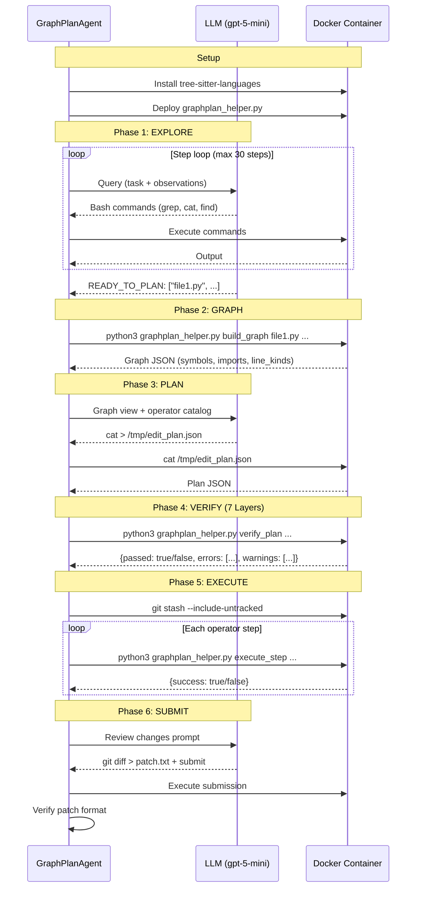

## Phase 1: Code Graph Construction

### What is the Code Graph?

The code graph is a lightweight structural representation of source files, built using **tree-sitter** via the `tree-sitter-languages` package. It captures three things:

1. **Symbols** - classes, functions, methods, structs, traits, interfaces, enums with their line ranges
2. **Imports** - module imports with line numbers (language-specific parsing)
3. **Line kinds** - structural markers (if/for/while/return/raise/try) at specific lines

### Supported Languages

| Language | Extensions | Symbol Types |
|----------|-----------|-------------|
| Python | `.py` | class, function |
| JavaScript | `.js`, `.jsx` | class, function, method, exported class/function |
| TypeScript | `.ts`, `.tsx` | class, function, method, interface, enum, type alias |
| Java | `.java` | class, method, interface, enum, constructor |
| Go | `.go` | function, method, type (struct) |
| Rust | `.rs` | function, struct, enum, trait, impl |
| Ruby | `.rb` | class, method, module, singleton method |
| PHP | `.php` | class, function, method, interface, trait |
| C | `.c`, `.h` | function, struct, enum, typedef |
| C++ | `.cpp`, `.cxx`, `.cc`, `.hpp`, `.hxx` | function, class, struct, enum, namespace |

### How it's Built

The helper script `graphplan_helper.py` runs **inside the Docker container**. It uses `tree-sitter-languages` for all supported languages. Each language has S-expression queries defined in `LANGUAGE_QUERIES` for extracting symbols and imports, plus `LINE_KIND_MAP` for normalizing control-flow node types.

```python
def build_graph_ts(file_paths):
    result = {"symbols": [], "imports": [], "line_kinds": {}, "errors": []}
    for fp in file_paths:
        lang = detect_language(fp)               # Extension -> language
        parser = get_parser(lang)                 # tree-sitter parser
        tree = parser.parse(open(fp, "rb").read())
        ts_lang = get_language(lang)

        # S-expression queries for symbols
        query = ts_lang.query(LANGUAGE_QUERIES[lang]["symbols"])
        captures = query.captures(tree.root_node)
        _extract_symbols_from_captures(captures, fp, lang, result)

        # S-expression queries for imports
        query = ts_lang.query(LANGUAGE_QUERIES[lang]["imports"])
        captures = query.captures(tree.root_node)
        _extract_imports_from_captures(captures, fp, lang, result)

        # Tree walk for line-level constructs
        _walk_for_line_kinds(tree.root_node, LINE_KIND_MAP[lang], file_line_kinds)
```

### tree-sitter Version Compatibility

The `tree-sitter-languages` package bundles pre-built parsers compiled against tree-sitter 0.20.x. tree-sitter 0.21+ changed `Language.__init__()` from `(path, name)` to `(ptr)`, breaking the Cython bindings. The agent pins `tree-sitter<0.21` to avoid this.

Installation uses a **functional verification** approach rather than a simple import check:

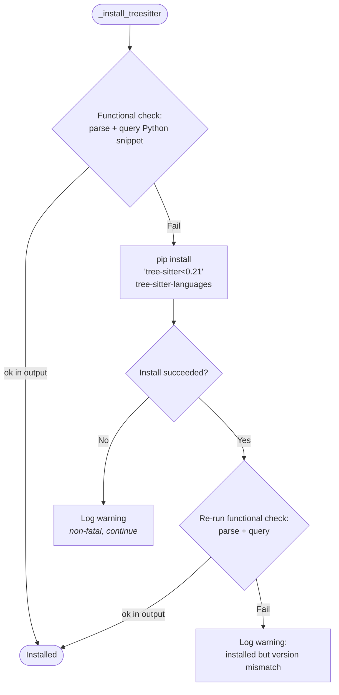

The functional check actually parses `def f(): pass` and runs an S-expression query, catching version mismatches at install time rather than during graph construction.

### Error Reporting

The graph builder reports errors explicitly rather than silently swallowing them:

```json
{
  "symbols": [...],
  "imports": [...],
  "line_kinds": {...},
  "errors": [
    "Cannot get parser for ruby (lib/foo.rb): ...",
    "Parse failed for src/broken.py: ..."
  ]
}
```

Each `try/except` block in the graph builder captures the error message and appends it to the `"errors"` list. The agent logs these errors and displays them in the console.

### tree-sitter API Version Handling

The `query.captures()` return type changed between tree-sitter versions:
- Older: `list[(Node, str)]` (list of tuples)
- Newer: `dict[str, list[Node]]` (dict of tag -> nodes)

The helper handles both via `_get_captures_list()`:

```python
def _get_captures_list(captures, tag):
    if isinstance(captures, dict):
        return captures.get(tag, [])
    return [n for n, name in captures if name == tag]
```

### Graph JSON Schema

```json
{
  "symbols": [
    {
      "name": "BaseSchema",
      "kind": "class",
      "file": "src/marshmallow/schema.py",
      "start_line": 45,
      "end_line": 920
    },
    {
      "name": "_invoke_field_validators",
      "kind": "function",
      "file": "src/marshmallow/schema.py",
      "start_line": 863,
      "end_line": 878
    }
  ],
  "imports": [
    {
      "file": "src/marshmallow/schema.py",
      "module": "marshmallow.utils",
      "symbol": "missing",
      "line": 12
    }
  ],
  "line_kinds": {
    "src/marshmallow/schema.py": {
      "863": "if_statement",
      "870": "for_statement",
      "875": "return_statement"
    }
  },
  "errors": []
}
```

### Graph View (LLM-Facing)

The raw JSON is transformed into a compact text view for the LLM:

```
FILE: src/marshmallow/schema.py
  IMPORT: from marshmallow.utils import missing [line 12]
  IMPORT: from marshmallow.fields import Field [line 13]
  CLASS: BaseSchema (lines 45-920)
  FUNCTION: __init__ (lines 50-78)
  FUNCTION: _invoke_field_validators (lines 863-878)
  FUNCTION: _invoke_schema_validators (lines 880-895)
```

This gives the LLM precise structural information (class names, function boundaries, import locations) without sending the entire source code. The LLM already read the source during the explore phase -- the graph view provides a structural map for planning.

## Phase 2: AST-Node Transformation Primitives

### Architecture Overview

The edit system has three layers:

1. **Primitives** (6 mutators + 2 read-only) — Low-level AST-node operations that use **locators** to find targets structurally. Each primitive has pre/postcondition checking and automatic rollback on failure.
2. **Composed operators** (3 built-in + LLM-defined) — Higher-level operations expressed as sequences of primitives via a JSON DSL. Built-in: `add_method`, `add_import`, `add_class_attribute`.
3. **Legacy operators** (10 original) — String/line-based operators kept for backward compatibility.

```mermaid
flowchart TD
    subgraph Primitives ["AST-Node Primitives"]
        direction LR
        RN[replace_node]
        IBN[insert_before_node]
        IAN[insert_after_node]
        DN[delete_node]
        WN[wrap_node]
        RAM[replace_all_matching]
    end

    subgraph ReadOnly ["Read-Only Primitives"]
        direction LR
        LOC[locate]
        LR2[locate_region]
    end

    subgraph Composed ["Composed Operators"]
        direction LR
        AM2[add_method]
        AI2[add_import]
        ACA2[add_class_attribute]
        CUSTOM["LLM-defined<br/>(via define_operators)"]
    end

    subgraph Legacy ["Legacy Operators (backward compat)"]
        direction LR
        RC2[replace_code]
        IC2[insert_code]
        DL2[delete_lines]
        MORE["...7 more"]
    end

    Composed -->|"expand to"| Primitives
    Primitives -->|"use"| Locators["Locator System<br/>(AST node addressing)"]

    style Primitives fill:#1a3a2a,stroke:#2d6a4f
    style Composed fill:#1a2a3a,stroke:#2d4f6a
    style Legacy fill:#3a2a1a,stroke:#6a4f2d
```

### The Locator System

Every primitive identifies its target via a **Locator** — a JSON object resolved against the live AST. Locators re-query the fresh AST on every step, eliminating line-drift issues entirely.

#### Structured Locator (common cases)

```json
{"kind": "function", "name": "defer", "file": "query.py",
 "parent": {"kind": "class", "name": "QuerySet"}}
```

#### S-Expression Locator (advanced)

```json
{"type": "sexp", "file": "query.py",
 "query": "(identifier) @id (#eq? @id \"defer\")", "capture": "id"}
```

#### Locator Fields

| Field | Description |
|-------|-------------|
| `kind` | Normalized AST kind: `function`, `class`, `method`, `import`, `statement`, `interface`, `enum`. Auto-mapped to language-specific tree-sitter node types via `NORMALIZED_KINDS` |
| `name` | Symbol name (for named nodes) |
| `file` | File path |
| `parent` | Nested locator constraining search to children of parent |
| `field` | Named tree-sitter field of matched node (`body`, `parameters`, `condition`) |
| `nth_child` | Select Nth child of matched node (-1 for last) |
| `index` | Disambiguate when multiple matches (0-based). Error if >1 match and no index |

#### Kind Normalization (`NORMALIZED_KINDS`)

Reuses existing `LANGUAGE_QUERIES` and `LINE_KIND_MAP`. Maps normalized kind names to per-language tree-sitter node types:

| Normalized | Python | JavaScript | Java | Go | Rust | C/C++ |
|-----------|--------|-----------|------|----|----|------|
| `function` | `function_definition` | `function_declaration`, `arrow_function` | `method_declaration`, `constructor_declaration` | `function_declaration`, `method_declaration` | `function_item` | `function_definition` |
| `class` | `class_definition` | `class_declaration` | `class_declaration` | — | `struct_item` | `class_specifier`, `struct_specifier` |
| `method` | `function_definition` | `method_definition` | `method_declaration` | `method_declaration` | `function_item` | `function_definition` |
| `import` | `import_statement`, `import_from_statement` | `import_statement` | `import_declaration` | `import_declaration` | `use_declaration` | `preproc_include` |
| `statement` | `expression_statement`, `return_statement`, ... | `expression_statement`, `return_statement`, ... | (same pattern) | (same pattern) | (same pattern) | (same pattern) |

#### Locator Resolution (`resolve_locator`)

```python
def resolve_locator(locator, file_path, language, tree=None, source=None):
    """Resolve a locator against the live AST, returning matching nodes."""
    if locator.get("type") == "sexp":
        # S-expression query: run tree-sitter query, return captured nodes
        query = ts_lang.query(locator["query"])
        captures = query.captures(tree.root_node)
        return _get_captures_list(captures, locator.get("capture", "target"))

    # Structured locator: walk AST matching kind + name
    kind = locator.get("kind")
    name = locator.get("name")
    target_types = _get_normalized_node_types(kind, language)
    matches = []
    _collect_matching_nodes(tree.root_node, target_types, name, kind, language, matches)

    # Apply parent constraint (filter to nodes inside parent)
    if "parent" in locator:
        parent_nodes = resolve_locator(locator["parent"], file_path, language, tree, source)
        matches = [m for m in matches if any(_is_descendant(m, p) for p in parent_nodes)]

    # Apply field selection (navigate to named child field)
    if "field" in locator:
        matches = [m.child_by_field_name(locator["field"]) for m in matches if m.child_by_field_name(locator["field"])]

    # Apply nth_child selection
    if "nth_child" in locator:
        matches = [m.children[locator["nth_child"]] for m in matches if m.children]

    # Apply index disambiguation
    if "index" in locator and len(matches) > 1:
        matches = [matches[locator["index"]]]

    return matches
```

### Mutator Primitives

6 mutators + 1 batch operation. Each follows the **execution protocol**: pre-check → save original → apply byte-level edit → post-check → rollback on failure.

#### Execution Protocol

```python
def _execute_primitive(name, params):
    locator = params["locator"]
    filepath = locator["file"]
    original = open(filepath, "rb").read()       # save for rollback
    tree = parser.parse(original)                # fresh AST
    nodes = resolve_locator(locator, filepath, lang, tree, original)
    _check_preconditions(name, filepath, nodes, params)  # fail fast
    new_content = _apply_primitive_edit(name, filepath, nodes, params, original)
    open(filepath, "wb").write(new_content)
    if not _check_postconditions(name, filepath, locator, params):
        open(filepath, "wb").write(original)     # ROLLBACK
        return {"success": False, "rolled_back": True, "error": "Postcondition failed"}
    return {"success": True}
```

#### `replace_node`

Replaces the text of an AST node identified by a locator.

| | |
|---|---|
| **Parameters** | `locator` (target node), `replacement` (new source text) |
| **Precondition** | Locator resolves to exactly 1 node |
| **Postcondition** | File parses without errors |

```json
{"op": "replace_node", "params": {
  "locator": {"kind": "function", "name": "defer", "file": "src/query.py",
              "parent": {"kind": "class", "name": "QuerySet"}},
  "replacement": "def defer(self, *fields, clear_cache=True):\n        ..."
}}
```

#### `insert_before_node` / `insert_after_node`

Insert code before or after an AST node.

| | |
|---|---|
| **Parameters** | `locator` (anchor node), `code` (text to insert), `separator` (optional, default `"\n"`) |
| **Precondition** | Locator resolves to ≥1 node |
| **Postcondition** | File parses without errors |

```json
{"op": "insert_after_node", "params": {
  "locator": {"kind": "import", "file": "src/query.py", "index": -1},
  "code": "from collections import OrderedDict"
}}
```

#### `delete_node`

Removes an AST node entirely.

| | |
|---|---|
| **Parameters** | `locator` (target node) |
| **Precondition** | Locator resolves to ≥1 node |
| **Postcondition** | File parses without errors, node no longer exists |

```json
{"op": "delete_node", "params": {
  "locator": {"kind": "function", "name": "deprecated_helper", "file": "src/utils.py"}
}}
```

#### `wrap_node`

Wraps an AST node with before/after code.

| | |
|---|---|
| **Parameters** | `locator` (target node), `before` (prefix code), `after` (suffix code), `indent_body` (optional, extra indentation for wrapped content) |
| **Precondition** | Locator resolves to ≥1 node |
| **Postcondition** | File parses without errors |

```json
{"op": "wrap_node", "params": {
  "locator": {"kind": "statement", "file": "src/query.py", "index": 0},
  "before": "try:\n    ", "after": "\nexcept ValueError:\n    pass"
}}
```

#### `replace_all_matching`

Replaces all AST nodes matching a locator. Processes replacements bottom-up (last byte offset first) to avoid invalidation.

| | |
|---|---|
| **Parameters** | `locator` (target nodes), `replacement` (new text), `filter` (optional: `"not_in_string_or_comment"`) |
| **Precondition** | Locator resolves to ≥1 node |
| **Postcondition** | File parses without errors, 0 matches remain |

```json
{"op": "replace_all_matching", "params": {
  "locator": {"type": "sexp", "file": "src/query.py",
              "query": "(identifier) @id (#eq? @id \"old_name\")", "capture": "id"},
  "replacement": "new_name",
  "filter": "not_in_string_or_comment"
}}
```

### Read-Only Primitives

| Primitive | Input | Output |
|-----------|-------|--------|
| **`locate`** | `{locator}` | `{found, count, nodes: [{start_line, end_line, kind, text_preview}]}` |
| **`locate_region`** | `{locator}` | `{start_byte, end_byte, start_line, end_line, text}` |

These are used within composed operators for conditional logic and variable binding.

### Composed Operators

Built-in composed operators are expressed as sequences of primitive steps. They map the legacy high-level operators to AST-node primitives.

#### Built-in Composed Operators

| Operator | Expands To |
|----------|-----------|
| `add_method` | `locate` class body → `insert_after_node` at last child |
| `add_import` | `locate` last import → `insert_after_node` |
| `add_class_attribute` | `locate` class body → `insert_before_node` at first non-docstring child |

Example expansion of `add_method`:
```json
[
  {"primitive": "locate", "params": {
    "locator": {"kind": "class", "name": "$class_name", "file": "$file", "field": "body"}
  }, "bind": "body"},
  {"primitive": "insert_after_node", "params": {
    "locator": {"kind": "class", "name": "$class_name", "file": "$file", "field": "body", "nth_child": -1},
    "code": "\n$method_code"
  }}
]
```

#### LLM-Defined Custom Operators (`define_operators`)

The LLM can define custom operators at plan time using the JSON DSL:

```json
{
  "define_operators": [
    {
      "define": "add_cached_property",
      "params_schema": {"file": "string", "class_name": "string", "prop_name": "string", "body": "string"},
      "steps": [
        {"primitive": "insert_after_node", "params": {
          "locator": {"kind": "class", "name": "$class_name", "file": "$file", "field": "body", "nth_child": -1},
          "code": "\n    @cached_property\n    def $prop_name(self):\n$body"
        }}
      ]
    }
  ],
  "plan": [
    {"op": "add_import", "params": {"file": "query.py", "import_statement": "from functools import cached_property"}},
    {"op": "add_cached_property", "params": {"file": "query.py", "class_name": "QuerySet", "prop_name": "_key", "body": "        return hash(self.query)"}}
  ]
}
```

**Variable binding**: `$param` references operator params; `{"primitive": ..., "bind": "var"}` captures output; `$var.field` accesses nested fields.

**Conditional logic** (limited, intentional): `{"if": "$var.count > 0", "then": {...}, "else": {...}}`

Custom operators are **ephemeral** — they exist only for the current plan.

### DSL Interpreter

The DSL interpreter (`execute_dsl_steps`, `resolve_var`) handles:

1. **Variable resolution**: `$param` references in strings, dicts, and lists are resolved from the current variable context
2. **Step execution**: Each step in a composed operator is executed as a primitive
3. **Binding**: `"bind": "var_name"` captures the output of a step for use in subsequent steps
4. **Conditionals**: `{"if": "expr", "then": step, "else": step}` for simple branching

### Plan Formats

Two formats are supported:

#### Array format (simple)
```json
[
  {"op": "replace_node", "params": {"locator": {...}, "replacement": "..."}},
  {"op": "add_import", "params": {"file": "src/query.py", "import_statement": "..."}}
]
```

#### Object format (with custom operators)
```json
{
  "define_operators": [...],
  "plan": [
    {"op": "replace_node", "params": {...}},
    {"op": "custom_op", "params": {...}}
  ]
}
```

### Plan Validation

Extracted JSON is validated with `_is_valid_plan()` which accepts both formats:

```python
@staticmethod
def _is_valid_plan(plan) -> bool:
    if isinstance(plan, dict) and "plan" in plan:
        return _is_valid_plan(plan["plan"])  # validate inner plan list
    if not isinstance(plan, list) or len(plan) == 0:
        return False
    return isinstance(plan[0], dict) and "op" in plan[0]
```

### How the LLM Writes the Plan

The LLM model always requires bash tool calls (enforced by LitellmModel). So the plan generation phase instructs the LLM to write the JSON plan to a file via bash:

```bash
cat > /tmp/edit_plan.json << 'PLAN_EOF'
[{"op": "replace_node", "params": {"locator": {...}, ...}}]
PLAN_EOF
```

The agent then reads `/tmp/edit_plan.json` from the container. This naturally satisfies the tool-call requirement while capturing structured plan data. If the file isn't written, the agent:
1. Scans message content for JSON as a fallback (with `_is_valid_plan` validation)
2. Nudges the LLM to write the file (up to 5 attempts)
3. Falls back to standard step loop if plan generation fails entirely

### Mapping Legacy Operators to Primitives

| Legacy Operator | Primitive Equivalent |
|-------------|-----------------|
| `replace_code(file, pattern, replacement)` | `replace_node` with locator targeting the AST node containing the pattern |
| `insert_code(file, anchor_line, position, code)` | `insert_before_node` / `insert_after_node` with structural locator |
| `delete_lines(file, start, end)` | `delete_node` targeting the statement/block node |
| `add_method(file, class, code)` | Composed: `locate` class body → `insert_after_node` |
| `add_import(file, stmt)` | Composed: `locate` last import → `insert_after_node` |
| `modify_function_signature(file, func, old, new)` | `replace_node` targeting `{kind: "function", name, field: "parameters"}` |
| `rename_symbol(file, old, new)` | `replace_all_matching` with S-exp locator + `filter: "not_in_string_or_comment"` |
| `wrap_block(file, start, end, before, after)` | `wrap_node` targeting the statement node |
| `add_class_attribute(file, class, code)` | Composed: `locate` class body → `insert_before_node` |
| `replace_function_body(file, func, body)` | `replace_node` targeting `{kind: "function", name, field: "body"}` |

### Legacy Operators (Backward Compatibility)

The original 10 string/line-based operators are still available. They use text matching and line numbers rather than AST locators. When a step uses a legacy operator name with legacy parameter format (no `locator`), execution routes through the original `_exec_*` functions.

<details>
<summary>Legacy operator reference (click to expand)</summary>

#### `replace_code` — String find-and-replace (`content.replace(pattern, replacement, 1)`)
#### `insert_code` — Line-anchored insertion at `anchor_line`
#### `delete_lines` — Range deletion by line numbers
#### `add_method` — Tree-sitter-guided class insertion (legacy implementation)
#### `add_import` — Import statement insertion after last import
#### `modify_function_signature` — Signature string replacement
#### `rename_symbol` — Word-boundary regex rename
#### `wrap_block` — Indentation-aware block wrapping by line range
#### `add_class_attribute` — Class-level attribute insertion (legacy implementation)
#### `replace_function_body` — Full body replacement via tree-sitter

</details>

## Phase 3: Plan Verification -- The 7-Layer System

### Honest Assessment

The plan verification system is **not** formal verification in the academic sense. It does not provide mathematical proofs of correctness, and it cannot guarantee that a plan will produce a semantically valid transformation. However, it covers 7 layers of pre-execution checking plus **locator-based precondition checking** for AST-node primitives:

```mermaid
flowchart LR
    subgraph Actually ["What We Actually Have"]
        A0b["Locator preconditions<br/><i>AST node resolution check</i>"]
        A1["Schema validation<br/><i>valid op, required params</i>"]
        A2["Referential integrity<br/><i>symbols exist in graph</i>"]
        A3["Bounds checking<br/><i>line numbers in range</i>"]
        A4["Pattern existence<br/><i>pre-check + fuzzy match</i>"]
        A5["Line drift detection<br/><i>cumulative shift warnings</i>"]
        A6["AST context checking<br/><i>string/comment detection</i>"]
        A7["Scope analysis<br/><i>def/ref/string classification</i>"]
        A8["Preflight syntax<br/><i>simulated replacement check</i>"]
        A9["Cross-file impact<br/><i>import graph analysis</i>"]
    end

    subgraph Not ["What We Don't Have"]
        N1["Semantic verification<br/><i>no type checking,<br/>no reference resolution</i>"]
        N2["Behavioral proof<br/><i>no guarantee the fix<br/>actually solves the bug</i>"]
    end

    style Actually fill:#1a3a2a,stroke:#2d6a4f
    style Not fill:#3a1a1a,stroke:#6a2d2d
```

| What we call it | What it really is | What formal verification would require |
|---|---|---|
| "Locator precondition" | **AST node resolution** — verify the locator finds the expected target node in the live AST | Proving the locator semantics match intent |
| "Precondition verification" | **Schema validation** + **referential integrity** + **content pre-checks** + **line drift analysis** + **AST context** + **scope classification** + **cross-file impact** | Proving the transformation preserves program semantics |
| "Postcondition validation" | **Syntax linting** (no parse errors after edit) + per-primitive rollback | Proving the output satisfies a specification |
| `_syntax_check()` | Parse tree has no ERROR nodes (both post-execution and pre-flight) | Would need type checking, data-flow analysis |

### The Semantic Gap (Narrowed Further)

With the primitive system, the semantic gap is further narrowed. AST-node primitives use **structural locators** instead of text patterns, which eliminates the most fragile matching. The locator system re-queries the live AST on every step, so there is no line drift.

```mermaid
flowchart TD
    subgraph Structural ["Structurally Verifiable (AST locators)"]
        S1["replace_node: locator finds target<br/>function/class node? YES"]
        S2["delete_node: locator resolves<br/>to existing node? YES"]
        S3["insert_after_node: anchor<br/>node exists in AST? YES"]
    end

    subgraph Composed ["Composed Operator Verification"]
        C1["add_method: class exists<br/>in graph? Locator resolves?"]
        C2["add_import: last import<br/>node found?"]
    end

    subgraph LegacyContent ["Legacy Content-Verified (Layers 1, 3, 5)"]
        R1["replace_code: pattern exists<br/>in file? Fuzzy match."]
        R3["Replacement produces valid<br/>syntax? Preflight simulated."]
    end

    subgraph Remaining ["Remaining Semantic Gap"]
        G1["Does the fix actually<br/>solve the bug?"]
    end

    S1 -.- Note1["Locator-based<br/>precondition checking"]
    C1 -.- Note2["Graph + locator checks"]
    R1 -.- Note3["Content pre-checks<br/>(legacy operators only)"]
    G1 -.- Note4["Only tests can verify<br/>behavioral correctness"]

    style Structural fill:#1a3a2a,stroke:#2d6a4f
    style Composed fill:#1a2a3a,stroke:#2d4f6a
    style LegacyContent fill:#2a3a1a,stroke:#4f6a2d
    style Remaining fill:#3a2a1a,stroke:#6a4f2d
```

**Primitive ops** have locator-based precondition checking (Layer 0b) that verifies the target node exists in the AST before plan execution begins.

**Legacy operators** retain the original 7-layer verification (Layers 0-6).

### What the Verification Actually Checks

The `verify_plan()` function runs inside the Docker container, receives the plan JSON and graph JSON, and checks every step. It handles both plan formats (array and object with `define_operators`). Errors block execution; warnings are displayed but don't block. All layers degrade gracefully when tree-sitter is unavailable.

#### Layer 0: Structural Checks (Schema + File + Graph + Bounds)

Every step must have a valid operator name, all required parameters, target an existing file, reference valid graph symbols, and use valid line ranges.

| Check | Rule | Error format |
|-------|------|-------------|
| Operator name | `op in ALL_VALID_OPS` (primitives + composed + legacy) | `"Step {i}: Unknown operator '{op}'"` |
| Required params | All keys in `REQUIRED_PARAMS[op]` present (legacy ops) | `"Step {i}: Missing parameter '{p}' for {op}"` |
| File exists | `os.path.isfile(file_path)` | `"Step {i}: File '{path}' does not exist"` |
| Symbol in graph | Class/function exists with correct kind and file | `"Step {i} ({op}): Class/Function '{name}' not found"` |
| Line range valid | `anchor_line` in range, `start_line <= end_line` | `"anchor_line {n} out of range"` / `"start_line > end_line"` |

**What this catches:** Hallucinated operators, missing parameters, nonexistent files/symbols, out-of-bounds lines.

#### Layer 0b: Locator-Based Precondition Checks (Primitive Ops)

For steps using AST-node primitives, verifies that the locator resolves to at least one node in the current AST. This catches hallucinated node names or incorrect structural paths before execution.

| Check | Rule | Error format |
|-------|------|-------------|
| Locator resolves | `resolve_locator()` returns ≥1 node | `"Step {i} ({op}): Locator did not match any AST node"` |
| File in locator | Locator has `file` field pointing to existing file | `"Step {i} ({op}): Locator file '{path}' does not exist"` |

```python
if op in PRIMITIVE_OPS and "locator" in params:
    locator = params["locator"]
    file_path = locator.get("file")
    if file_path and os.path.isfile(file_path):
        nodes = resolve_locator(locator, file_path, detect_language(file_path))
        if not nodes:
            errors.append(f"Step {i} ({op}): Locator did not match any AST node")
```

**What this catches:** The AST-node equivalent of "pattern not found" — locators that specify nonexistent functions, classes, or structural paths. Caught at verification time, not execution time.

#### Layer 1: Content Existence Pre-Check

For every operator that depends on finding specific text in a file, verifies that the text actually exists **before beginning execution**. Uses `_fuzzy_find()` (difflib-based) for near-match detection.

| Operator | Check | Result |
|----------|-------|--------|
| `replace_code` | `pattern in content` | **Error** if not found (with fuzzy match **warning** if >80% similar) |
| `modify_function_signature` | `old_signature in content` | **Error** if not found |
| `rename_symbol` | `\b{old_name}\b` regex match | **Error** if not found |
| `add_import` | `import_statement.strip() in content` | **Warning** if already present (duplicate) |
| `add_method` | `def {method_name}(` regex in content | **Warning** if method name already exists |

```python
# Fuzzy match example
if pattern not in content:
    ratio, matched = _fuzzy_find(content, pattern)
    if ratio > 0.8:
        warnings.append(f"Step {i}: pattern not found exactly, "
                        f"but {ratio:.0%} similar match: {matched[:60]}...")
    else:
        errors.append(f"Step {i}: pattern not found in {file_path}")
```

**What this catches**: The single most common failure mode -- `replace_code` pattern does not exist because the LLM hallucinated the exact text. Previously caught only at runtime after earlier steps may have already modified files.

#### Layer 2: Cross-Step Line Drift Detection

Simulates the line-number impact of each step on subsequent steps targeting the same file. Groups steps by file, walks in order, computes cumulative drift:

| Operation | Drift |
|-----------|-------|
| `insert_code` | +N lines (code.count('\n') + 1) |
| `delete_lines` | -(end - start + 1) |
| `wrap_block` | +2 minimum (before_code + after_code) |
| `add_method` | +N lines at class end |
| `add_import` | +1 |
| `add_class_attribute` | +1 |
| `replace_code` | +(new_lines - old_lines) |

For each step using line numbers (`insert_code`, `delete_lines`, `wrap_block`), if cumulative drift != 0, emits a **warning** with drift amount.

```
WARNING: Step 3 (delete_lines): line numbers may be off by +3 lines due to earlier edits on src/schema.py
```

**What this catches**: Step 1 inserts 3 lines before line 50, Step 2 tries to `delete_lines(52, 55)` -- now those lines point to the wrong code.

#### Layer 3: AST Pattern Context Check

When a `replace_code` pattern is found in the file, checks whether the match falls inside a string literal or comment AST node. Uses tree-sitter to find the deepest node at the match position and walks ancestors checking for string/comment types.

Detected node types: `string`, `comment`, `string_literal`, `template_string`, `line_comment`, `block_comment`, `string_content`, `string_fragment`, `heredoc_body`, `regex`, etc.

```
WARNING: Step 0 (replace_code): Pattern match in src/foo.py at offset 42 is inside a string node (may not be actual code)
```

**What this catches**: Patterns that accidentally match inside string literals or comments rather than actual code.

**Graceful degradation**: Returns None (no warning) if tree-sitter is unavailable.

#### Layer 4: Symbol Occurrence Scope Analysis

For `rename_symbol`, classifies all occurrences of the symbol in the file:

| Classification | Description |
|---------------|-------------|
| `definitions` | Symbol is the `name` field of a definition node |
| `references` | Symbol used in code context |
| `in_strings` | Symbol appears inside a string literal |
| `in_comments` | Symbol appears inside a comment |

If `in_strings > 0` or `in_comments > 0`, emits a **warning** since regex rename will change these too.

```
WARNING: Step 2 (rename_symbol): 'old_name' also appears in strings (2x) and comments (1x) -- regex rename will change these too
```

**What this catches**: Renaming `data` to `result` also corrupts `"Enter your data:"`.

**Graceful degradation**: Returns None if tree-sitter is unavailable.

#### Layer 5: Preflight Syntax Simulation

For `replace_code`, simulates the replacement in memory (without writing to disk) and checks the result for syntax errors via tree-sitter:

```python
if pattern in content:
    simulated = content.replace(pattern, replacement, 1)
    ok, err = _syntax_check_content(simulated, file_path)
    if not ok:
        errors.append(f"Step {i} (replace_code): {err}")
```

**What this catches**: Replacement text that breaks syntax -- caught before any file is modified.

**Graceful degradation**: Returns (True, None) if tree-sitter is unavailable.

#### Layer 6: Cross-File Impact Analysis

Builds an import relationship graph from the code graph data and checks whether modified symbols are imported by files not included in the plan:

| Operation | Check |
|-----------|-------|
| `rename_symbol` | Is `old_name` imported by files not in the plan? |
| `modify_function_signature` | Is `func_name` imported by files not in the plan? |
| `delete_lines` | Do deleted lines contain symbols imported elsewhere? |

```
WARNING: Step 1 (rename_symbol): 'helper_func' is imported by files not in this plan: ['other.py', 'test.py']
```

**What this catches**: Renaming a symbol or changing a signature breaks importers in other files.

#### Plan Integrity Gate

Before verification begins, the plan JSON is validated:

```python
@staticmethod
def _is_valid_plan(plan: list) -> bool:
    if not isinstance(plan, list) or len(plan) == 0:
        return False
    return isinstance(plan[0], dict) and "op" in plan[0]
```

Rejects empty arrays, file lists (`["src/foo.py"]`), and non-dict arrays.

### Runtime Guards (During Execution)

What static verification can't catch, runtime guards handle. These are **not verification** -- they are fail-fast error handling with rollback.

#### Per-Operator Runtime Guards

| Operator | Runtime guard | Failure mode |
|----------|--------------|-------------|
| `replace_code` | `pattern in content` | `ValueError("Pattern not found")` -- **this is the most common failure** |
| `modify_function_signature` | `old_signature in content` | `ValueError("Old signature not found")` |
| `add_method` | `_find_class_node_ts()` returns result | `ValueError("Class not found")` |
| `add_class_attribute` | `_find_class_node_ts()` returns result | `ValueError("Class not found")` |
| `replace_function_body` | `_find_function_node_ts()` returns result | `ValueError("Function not found")` |
| `insert_code` | `anchor_line` in `[1, len(lines)]` | `ValueError("out of range")` |
| `delete_lines` | Range in bounds | `ValueError("out of bounds")` |
| `rename_symbol` | `file != "all"` | `ValueError("requires explicit file")` |
| `add_import` | None | Always succeeds |
| `wrap_block` | None | Always succeeds |

#### Universal Postcondition: Syntax Check

After every operator, `_syntax_check()` parses the modified file:


**What this catches:** Replacement text that breaks syntax (mismatched brackets, bad indentation, incomplete statements).

**What this misses:** Semantically invalid code that parses correctly (undefined variables, wrong types, logic errors).

### Verification Output Format

```json
{
  "passed": false,
  "errors": [
    "Step 0 (replace_code): Pattern not found in src/schema.py: 'for attr_name in self.__proc...'",
    "Step 2 (replace_code): Replacement produces syntax error in src/schema.py",
    "Step 3: Missing parameter 'pattern' for replace_code"
  ],
  "warnings": [
    "Step 1 (replace_code): Pattern not found exactly, but 92% similar match found: 'for attr in self.__processors...'",
    "Step 2 (rename_symbol): 'data' also appears in strings (2x) and comments (1x) -- regex rename will change these too",
    "Step 4 (delete_lines): line numbers may be off by +3 lines due to earlier edits on src/schema.py",
    "Step 5 (rename_symbol): 'helper_func' is imported by files not in this plan: ['views.py']"
  ]
}
```

All errors and warnings are collected (not short-circuited), so the LLM sees every problem in one revision prompt. **Errors** block execution (`passed = false`). **Warnings** are displayed in yellow in the console but don't block execution.

### Revision Loop

When verification fails, the agent feeds errors back to the LLM:

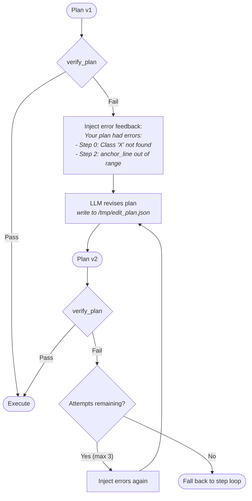

Up to `max_plan_revisions` (default: 3) attempts before falling back.

### Summary: Verification Strength by Operator

With the 7-layer system, all 10 operators now have pre-execution verification:

```mermaid
flowchart TD
    subgraph Full ["Fully Verifiable (Graph + Content + AST)"]
        direction LR
        RC["replace_code<br/><i>L1: pattern exists + fuzzy<br/>L3: AST context<br/>L5: preflight syntax</i>"]
        MFS["modify_function_signature<br/><i>L0: func in graph<br/>L1: old_sig exists<br/>L6: cross-file impact</i>"]
        RS["rename_symbol<br/><i>L1: name exists<br/>L4: scope analysis<br/>L6: cross-file impact</i>"]
        AM["add_method<br/><i>L0: class in graph<br/>L1: duplicate check</i>"]
        ACA["add_class_attribute<br/><i>L0: class in graph</i>"]
        RFB["replace_function_body<br/><i>L0: function in graph</i>"]
    end

    subgraph Structural ["Structurally Verifiable (Graph + Bounds + Drift)"]
        direction LR
        IC["insert_code<br/><i>L0: line in range<br/>L2: drift warning</i>"]
        DL["delete_lines<br/><i>L0: range in bounds<br/>L2: drift warning<br/>L6: cross-file impact</i>"]
        WB["wrap_block<br/><i>L0: range in bounds<br/>L2: drift warning</i>"]
        AI["add_import<br/><i>L1: duplicate warning</i>"]
    end

    Full -.- G1(["Content pre-checked + AST-aware"])
    Structural -.- G2(["Graph + bounds + drift detection"])

    style Full fill:#1a3a2a,stroke:#2d6a4f
    style Structural fill:#2a3a1a,stroke:#4f6a2d
```

### How Other Tools Handle This Problem

Before designing improvements, it's worth understanding how existing code transformation tools approach pattern matching, verification, and cross-step dependencies.

#### Coccinelle (Semantic Patches for C)

Coccinelle parses source code into intraprocedural control-flow graphs (CFGs), then compiles SmPL (Semantic Patch Language) patterns into CTL-VW (Computational Tree Logic with Variables and Witnesses) formulas. The CTL formula is model-checked against the CFG. Key concepts:

- **Isomorphisms**: Automatically considers semantically equivalent forms. Matching `(x==NULL)` also tries `(!x)`, `(NULL==x)`, etc. Eliminates false negatives from syntactic variation.
- **Scope via Paren(x)**: Constrains searches to specific function definition bodies, preventing accidental matches across scopes.
- **All-paths default**: A SmPL rule must match ALL control flow paths, preventing partial transforms.

**What we can steal**: The isomorphism concept (define equivalences for common Python patterns) and scope constraints for `rename_symbol`.

#### Comby (Structural Search/Replace)

Comby uses lightweight structural matching that understands balanced delimiters, string boundaries, and comment boundaries per language. Patterns use `:[hole]` holes that match lazily.

- **Balanced delimiter enforcement**: `f(:[args])` correctly matches `f(g(x), y)` without stopping at the first `)`.
- **Whitespace insensitivity**: Single/multiple spaces and newlines in templates are equivalent.
- **Language-aware boundaries**: Prevents false matches inside string literals or comments.

**What we can steal**: Whitespace-insensitive matching for `replace_code` -- the single highest-impact improvement. Currently `str.replace()` demands exact match; Comby's approach tolerates formatting differences.

#### ast-grep (Tree-sitter Structural Search)

ast-grep parses code into Concrete Syntax Trees via tree-sitter, then matches patterns against tree structure. Patterns look like ordinary code with meta-variables (`$VAR`, `$$VAR`, `$$$VAR`).

- **Kind constraints**: Meta-variables can be constrained by AST node kind (identifier vs string).
- **Relational rules**: `has`, `inside`, `follows`, `precedes` specify structural context.
- **Regex bridge**: Text-level matching on specific AST nodes.

**What we can steal**: Since we already have tree-sitter, ast-grep's pattern language is the most natural fit for structural matching. Could serve as foundation for AST-level pattern verification.

#### CodePlan (Microsoft, FSE 2024)

CodePlan frames repository-level coding as a planning problem with a dynamic, adaptive plan DAG.

- **Incremental dependency analysis**: After each edit, updates the dependency graph (imports, method calls, inheritance).
- **Change may-impact analysis**: When a method body is edited, escape analysis determines if callers are affected. Signature changes flag all callers for updates.
- **Adaptive plan graph**: Each node is a "code edit obligation." The graph grows dynamically as edits reveal new obligations.

**What we can steal**: The distinction between "localized" edits (body-only) and "escaping" edits (signature changes, renames). Escaping edits should be ordered last or trigger re-verification.

#### Aider (Layered Fuzzy Matching)

Aider uses SEARCH/REPLACE blocks with a layered fallback strategy:

1. **Exact match** -- direct string comparison
2. **Whitespace-insensitive match** -- normalize whitespace before comparison
3. **Indentation-preserving match** -- strip leading indentation uniformly
4. **Fuzzy match via difflib** -- `SequenceMatcher` with similarity threshold

**What we can steal**: Directly implementable as an enhancement to `_exec_replace_code()`. Replace the current `str.replace()` with a layered approach. This is the highest-leverage, lowest-effort improvement.

### The 7-Layer Verification Model

All 7 layers are now implemented. Layers 3, 4, 5 gracefully degrade when tree-sitter is unavailable.


#### Layer 0: Schema Validation

| Check | What it catches | Severity |
|-------|----------------|----------|
| Valid op name | Hallucinated operators (`edit_file`, `patch_code`) | Error |
| Required params | Missing parameters that crash at runtime | Error |
| File exists | Hallucinated file paths, typos | Error |
| Symbol in graph | Hallucinated class/function names | Error |
| Line range valid | Out-of-bounds line numbers, inverted ranges | Error |

#### Layer 1: Content Existence Pre-Check

Implemented via `_fuzzy_find()` (difflib-based sliding window) and `_extract_method_name()` (regex-based name extraction).

| Operator | Check | Severity |
|----------|-------|----------|
| `replace_code` | Pattern exists in file content | Error (or warning if >80% fuzzy match) |
| `modify_function_signature` | Old signature exists in file content | Error |
| `rename_symbol` | Old name exists as word-boundary match | Error |
| `add_import` | Import already present (duplicate guard) | Warning |
| `add_method` | Method name already exists in file | Warning |

**What this catches**: The single most common failure mode -- `replace_code` pattern mismatch.

#### Layer 2: Cross-Step Line Drift Analysis

Implemented via `_check_line_drift()`. Groups steps by file, walks in order, computes cumulative drift from line-changing operations.

| Operation | Drift Computation |
|-----------|------------------|
| `insert_code` | +N lines (code.count('\n') + 1) |
| `delete_lines` | -(end - start + 1) |
| `wrap_block` | +before_lines + after_lines |
| `add_method` | +N lines + 2 |
| `add_import` / `add_class_attribute` | +1 |
| `replace_code` | +(new_lines - old_lines) |

Emits **warnings** (not errors) when a line-number-dependent step has non-zero drift.

#### Layer 3: AST Pattern Context Check

Implemented via `_check_pattern_ast_context()`. When a `replace_code` pattern is found, checks whether the match position falls inside a string or comment AST node.

Uses tree-sitter to find the deepest node at the match byte offset, then walks ancestors checking against a universal set of string/comment node types. Emits a **warning** if the pattern is inside non-code context.

**Graceful degradation**: Returns None (no warning) if tree-sitter is unavailable.

#### Layer 4: Scope Analysis

Implemented via `_classify_symbol_occurrences()`. For `rename_symbol`, walks the AST and classifies every identifier matching the symbol name:

| Classification | Detection Method |
|---------------|-----------------|
| `definitions` | Identifier is the `name` field of a definition node |
| `references` | Identifier in code context (not string/comment/definition) |
| `in_strings` | Ancestor is a string-type node |
| `in_comments` | Ancestor is a comment-type node |

Emits a **warning** with counts when `in_strings > 0` or `in_comments > 0`.

**Graceful degradation**: Returns None if tree-sitter is unavailable.

#### Layer 5: Preflight Syntax Simulation

Implemented via `_syntax_check_content()`. For `replace_code`, simulates the replacement in memory (content.replace) and parses the result with tree-sitter to check for ERROR nodes -- **before writing to disk**.

Emits an **error** (blocks execution) if the simulated replacement produces a syntax error.

**Graceful degradation**: Returns (True, None) if tree-sitter is unavailable.

#### Layer 6: Cross-File Impact Analysis

Implemented via `_build_import_graph()`. Builds two maps from graph data:
- `symbol_importers`: symbol_name -> set of files that import it
- `file_exports`: file_path -> set of symbol names it defines

Checks each step for cross-file impact:
- `rename_symbol`: if `old_name` has importers not in plan -> warning
- `modify_function_signature`: if `func_name` has importers not in plan -> warning
- `delete_lines`: if deleted range overlaps a symbol imported elsewhere -> warning

### Operator-by-Operator Silent Failure Analysis

Each operator has specific failure modes that are **silent** (no error raised, but wrong code produced) or **late** (error raised only at execution time, after earlier steps have modified files). The table maps each failure to the verification layer that now catches it. Entries marked with a checkmark are implemented.

#### `replace_code`

| Silent Failure | Description | Caught By | Status |
|---|---|---|---|
| Pattern not found | LLM hallucinated text; `str.replace` gets no match | **Layer 1** (pre-check + fuzzy) | Implemented |
| Wrong occurrence | File has multiple matches; first is replaced, not intended one | **Layer 3** (AST context) | Partial (warns if in string/comment) |
| Whitespace mismatch | Pattern has `\t` but file has spaces, or trailing whitespace | **Layer 1** (fuzzy match) | Implemented |
| Pattern in string/comment | Matches inside a string literal, corrupts it | **Layer 3** (AST node type) | Implemented |
| Replacement creates syntax error | Valid pattern found, replacement is malformed | **Layer 5** (preflight syntax) | Implemented |

#### `insert_code`

| Silent Failure | Description | Caught By | Status |
|---|---|---|---|
| Anchor shifted by prior step | Earlier insert shifted lines, anchor now wrong | **Layer 2** (drift) | Implemented (warning) |
| Duplicate insertion | Same code inserted twice on retry | -- | Not implemented |
| Wrong semantic location | Anchor is mid-expression | -- | Not implemented |

#### `delete_lines`

| Silent Failure | Description | Caught By | Status |
|---|---|---|---|
| Lines shifted by prior step | Earlier changes shifted lines, now deleting wrong code | **Layer 2** (drift) | Implemented (warning) |
| Partial construct deleted | Deleting lines 50-53 of a 50-60 function leaves it broken | **Layer 5** (post-exec syntax) | Implemented (post-exec) |
| Symbol still imported | Deleting a symbol used by other files | **Layer 6** (cross-file impact) | Implemented (warning) |

#### `rename_symbol`

| Silent Failure | Description | Caught By | Status |
|---|---|---|---|
| Name not in file | Old name doesn't exist as word-boundary match | **Layer 1** (pre-check) | Implemented |
| Renames in strings | `"old_name"` becomes `"new_name"` | **Layer 4** (string classification) | Implemented (warning) |
| Renames in comments | `# old_name does X` corrupted | **Layer 4** (comment classification) | Implemented (warning) |
| Wrong scope | Local variable in unrelated function renamed | **Layer 4** (partial scope) | Partial (counts but doesn't prevent) |
| Shadowed variable | Inner function's local also renamed | -- | Not implemented |
| Name collision | `new_name` already exists in scope | -- | Not implemented |
| Cross-file breakage | Other files import `old_name` | **Layer 6** (cross-file impact) | Implemented (warning) |

#### `modify_function_signature`

| Silent Failure | Description | Caught By | Status |
|---|---|---|---|
| Old signature not found | Whitespace/formatting mismatch | **Layer 1** (pre-check) | Implemented |
| Callers not updated | Signature change requires call site updates | **Layer 6** (cross-file impact) | Implemented (warning) |

#### `add_method` / `add_class_attribute`

| Silent Failure | Description | Caught By | Status |
|---|---|---|---|
| Duplicate method name | Class already has method with that name | **Layer 1** (pre-check) | Implemented (warning) |

#### `wrap_block`

| Silent Failure | Description | Caught By | Status |
|---|---|---|---|
| Lines shifted by prior step | Line numbers wrong | **Layer 2** (drift) | Implemented (warning) |

### Implementation Status

All 7 layers + Layer 0b (locator preconditions) are implemented. The primitive system adds ~730 lines to `graph_plan_scripts.py` (locators, primitives, verifiers, DSL interpreter, composed operators).

```mermaid
flowchart LR
    subgraph Done ["All Layers Implemented"]
        direction TB
        P0b["Layer 0b: Locator Preconditions<br/><i>resolve_locator<br/>~150 lines</i>"]
        P1["Layer 1: Pattern Pre-Check<br/><i>_fuzzy_find + _extract_method_name<br/>~35 lines (legacy)</i>"]
        P2["Layer 2: Line Drift Analysis<br/><i>_check_line_drift<br/>~80 lines (legacy)</i>"]
        P3["Layer 3: AST Context Check<br/><i>_check_pattern_ast_context<br/>~50 lines</i>"]
        P4["Layer 4: Scope Analysis<br/><i>_classify_symbol_occurrences<br/>~60 lines</i>"]
        P5["Layer 5: Preflight Syntax<br/><i>_syntax_check_content<br/>~15 lines</i>"]
        P6["Layer 6: Cross-File Impact<br/><i>_build_import_graph<br/>~30 lines</i>"]
    end

    style Done fill:#1a3a2a,stroke:#2d6a4f
```

| Component | Functions | Lines | Dependencies |
|---|---|---|---|
| Locator system | `resolve_locator()`, `_collect_matching_nodes()`, `NORMALIZED_KINDS` | ~150 | tree-sitter |
| Mutator primitives | `_execute_primitive()`, 6 `_prim_*` functions | ~250 | tree-sitter |
| Verifier primitives | 6 `_verify_*` functions | ~80 | tree-sitter |
| DSL interpreter | `resolve_var()`, `execute_dsl_steps()`, `expand_composed_operator()` | ~150 | None |
| Composed operators | `BUILTIN_COMPOSED_OPS`, `_execute_composed_op()` | ~100 | DSL interpreter |
| Layer 0b | Locator resolution in `verify_plan()` | ~20 | Locator system |
| Layers 1-6 | (unchanged from original) | ~270 | Various |

All tree-sitter-dependent components degrade gracefully when tree-sitter is unavailable. Legacy operators (Layers 1-2) continue to work as before.

### Key Architectural Insight: Static vs Adaptive Plans

The most important lesson from CodePlan (Microsoft) is the distinction between **static plans** (generate complete plan, execute sequentially) and **adaptive plans** (plan grows/changes as edits reveal new impacts).

Our system uses a static plan with comprehensive pre-execution verification. The primitive system's **locator freshness** (re-querying the live AST on every step) provides a form of implicit adaptivity — each step operates on the current state, not stale assumptions.

Two pragmatic adaptations that could further improve reliability:

1. **Re-verify after each step**: After executing step N, re-run locator resolution for steps N+1, N+2, ... to check that their targets still exist. If not, trigger plan revision for remaining steps only. (The primitive system makes this natural since locators can be re-resolved cheaply.)

2. **Classify edits by escape risk**: `replace_node` with a body-only locator is **localized** (only affects the targeted node). `replace_all_matching` is **escaping** (affects all matching references). `delete_node` is **escaping** (may affect importers). Layer 6's cross-file impact analysis detects escaping edits for both primitives and legacy operators.

### Remaining Gaps

With the primitive system and 7-layer verification, the remaining gaps are:

| Gap | Description | Difficulty |
|-----|-------------|------------|
| Adaptive re-verification | Re-run layers after each step execution | Medium |
| Shadow detection | Detect when `replace_all_matching` affects shadowed variables in nested scopes | High |
| S-expression locator validation | Pre-verify S-expression locators during plan verification (currently only structured locators are checked) | Medium |
| Behavioral verification | Prove the fix actually solves the bug (fundamentally impossible without tests) | N/A |

Note: Several gaps from the legacy system are addressed by the primitive system:
- **Line drift** is eliminated by the locator system (no line numbers)
- **Scope-aware rename** is addressed by `replace_all_matching` with `filter: "not_in_string_or_comment"`
- **AST structural matching** is addressed by locators (structural node identification, not text patterns)

### Summary

The verification system provides **7 layers of defensive checking** plus **locator-based precondition checking** for AST-node primitives. The primitive system eliminates the most common failure modes by design:

- **Line drift** — eliminated entirely (locators re-query the live AST, no line numbers)
- **Pattern not found** — replaced by locator resolution (Layer 0b) for primitives; Layer 1 fuzzy matching for legacy ops
- **Syntax-breaking replacement** — per-primitive postcondition check + rollback
- **Cross-file breakage** — warned before execution (Layer 6)

The two-level rollback system (per-primitive + git stash) ensures the codebase is never left in an invalid state. Behavioral correctness (whether the fix actually solves the bug) can only be verified by running tests externally after the agent finishes.

## Phase 4: Execution with Postcondition Validation

### Execution Flow

Steps execute sequentially. Primitive ops use per-primitive rollback; legacy ops use the original syntax-check flow:

```mermaid
flowchart TD
    Start([Start execution]) --> Step["Next step in plan"]
    Step --> IsPrimitive{Primitive op?}

    IsPrimitive -->|Yes| PrimExec["_execute_primitive()"]
    PrimExec --> PreCheck["Pre-check:<br/>resolve locator,<br/>verify node exists"]
    PreCheck -->|Fail| PrimFail(["Step FAILED<br/><i>no file modified</i>"])
    PreCheck -->|OK| SaveOrig["Save original file"]
    SaveOrig --> ApplyEdit["Apply byte-level edit"]
    ApplyEdit --> PostCheck{"Post-check:<br/>parses_ok?<br/>postconditions?"}
    PostCheck -->|Fail| Rollback["ROLLBACK:<br/>restore original file"]
    Rollback --> PrimFail
    PostCheck -->|OK| More

    IsPrimitive -->|No (legacy)| Read[Read target file]
    Read --> Apply[Apply transformation]
    Apply --> Write[Write file back]
    Write --> SyntaxCheck{"_syntax_check(filepath)"}
    SyntaxCheck -->|Valid| More{More steps?}
    SyntaxCheck -->|"ERROR nodes"| Failed([Step FAILED])

    More -->|Yes| Step
    More -->|No| Success([All steps OK])
```

### Two-Level Rollback

**Level 1: Per-primitive rollback** — Each primitive saves the original file content before editing. If postconditions fail (syntax error, node not found after edit), the original file is immediately restored. This prevents a single broken primitive from corrupting the codebase.

**Level 2: Git stash rollback** — The agent uses `git stash` for plan-level transactional safety. If any step fails (after per-primitive rollback), the entire plan's changes are rolled back.


## Phase 5: Post-Submission Patch Verification

After submission, the agent verifies patch format (without running any tests):
- `diff --git` header present
- `--- a/` and `+++ b/` markers present
- `@@` hunk markers present
- Contains actual additions (`+` lines)
- `git apply --check` passes (dry-run)

Test evaluation (FAIL_TO_PASS / PASS_TO_PASS) is performed externally by the SWE-bench evaluation harness after the agent has finished. The agent never sees test results during its run.

## Invariants Maintained Throughout

### 1. Syntactic Validity Invariant
**After every operator execution**, the modified file must pass language-aware syntax checking. For tree-sitter-supported languages, this means no `ERROR` nodes in the parse tree. Checked after each step, not just at the end.

### 2. Graph Consistency Invariant
**Before execution**, every operator's preconditions are checked against the code graph via 7 layers of verification. The graph is built from the *current* state of files, so it reflects the actual codebase. Content existence (Layer 1), AST context (Layer 3), scope analysis (Layer 4), preflight syntax (Layer 5), and cross-file impact (Layer 6) are all verified pre-execution.

### 3. Transactional Execution Invariant
**If any primitive step fails**, the individual file is immediately rolled back to its pre-edit state (per-primitive rollback). **If the overall plan fails**, the entire set of changes is rolled back via `git stash pop`. The codebase is never left in a partially-modified state from a failed plan.

### 4. File Existence Invariant
**Before execution**, every file referenced in the plan is verified to exist on disk. This prevents operators from silently creating new files or operating on phantoms.

### 5. Sequential Consistency
Operators execute **in order**. Later operators see the effects of earlier ones. This means `add_import` followed by `replace_code` that uses the imported symbol will work correctly.

### 6. Plan Integrity Invariant
**Extracted JSON is validated** as an actual plan before being treated as one. Accepted formats: list of dicts with `"op"` key, or object with `"plan"` key containing such a list. File lists and other JSON from message content are rejected.

### 7. Locator Freshness Invariant
**Every primitive re-queries the live AST** before operating. Locators are resolved against the current parse tree, not cached results. This means step N+1 always sees the effects of step N, eliminating line-drift issues.

## Verification Pipeline Summary

```mermaid
flowchart TD
    Start([Plan generated by LLM]) --> Format["Parse plan format<br/>(array or object)"]
    Format --> Verify

    subgraph Verify ["Verification Layers"]
        V0["Layer 0: Schema + File + Graph + Bounds"]
        V0b["Layer 0b: Locator Preconditions<br/>(primitive ops only)"]
        V1["Layer 1: Content Existence + Fuzzy Match<br/>(legacy ops only)"]
        V3["Layer 3: AST Context Check"]
        V4["Layer 4: Scope Analysis"]
        V5["Layer 5: Preflight Syntax"]
        V2["Layer 2: Line Drift<br/>(legacy ops only)"]
        V6["Layer 6: Cross-File Impact"]
        V0 --> V0b --> V1 --> V3 --> V4 --> V5
        V5 -.-> V2 --> V6
    end

    Verify -->|"PASS<br/>(+ warnings displayed)"| Exec
    Verify -->|FAIL| Revise1[Revise plan<br/><i>up to 3 attempts</i>]
    Revise1 --> Verify

    subgraph Exec ["Execution (per step)"]
        Route{Primitive?}
        Route -->|Yes| Prim["_execute_primitive()<br/>pre-check → edit → post-check<br/>→ rollback on failure"]
        Route -->|No| Legacy["Legacy exec<br/>apply → syntax check"]
    end

    Prim -->|OK| NextStep{More steps?}
    Legacy -->|OK| NextStep
    NextStep -->|Yes| Route
    NextStep -->|No| Submit
    Prim -->|FAIL| Rollback["Rollback<br/><i>per-primitive + git stash pop</i>"]
    Legacy -->|FAIL| Rollback
    Rollback --> Revise2[Revise plan]
    Revise2 --> Verify

    subgraph Submit ["Submission"]
        S1[git diff] --> S2[Patch format check] --> S3[git apply --check]
    end

    Submit --> Done([Done])

    style Verify fill:#2a1a3a,stroke:#6a2daa
    style Exec fill:#1a2a3a,stroke:#2d4f6a
    style Submit fill:#1a3a2a,stroke:#2d6a4f
```

## Graceful Degradation

GraphPlan falls back to a standard step loop (DefaultAgent behavior) at multiple points:

```mermaid
flowchart LR
    subgraph HappyPath ["Happy Path"]
        direction LR
        HP1[EXPLORE] --> HP2[GRAPH] --> HP3[PLAN] --> HP4[VERIFY] --> HP5[EXECUTE] --> HP6[SUBMIT]
    end

    HP1 -->|"max_explore_steps<br/>exhausted"| FB([Fallback:<br/>Step Loop])
    HP2 -->|"empty graph<br/>or ts unavailable"| FB
    HP3 -->|"empty plan<br/>after 5 attempts"| FB
    HP4 -->|"failed after<br/>max_plan_revisions"| FB
    HP5 -->|"failed after<br/>revision"| FB

    style FB fill:#3a2a1a,stroke:#6a4f2d
    style HappyPath fill:#1a2a3a,stroke:#2d4f6a
```

In fallback mode, the LLM continues with free-form bash commands -- the same behavior as the baseline DefaultAgent. This ensures GraphPlan is never *worse* than the baseline.

## Configuration

```yaml
agent:
  agent_class: graphplan
  max_explore_steps: 30    # Max steps for file discovery
  max_plan_revisions: 3    # Max plan revision attempts
  step_limit: 250          # Overall step limit
  cost_limit: 3.0          # Dollar cost limit
```

## Running

```bash
# Single instance
mini-extra swebench-single -c swebench_graphplan.yaml -i 0 --yolo --exit-immediately

# Batch (5 instances)
mini-extra swebench -c swebench_graphplan.yaml --subset lite --slice 0:5 -o results/graphplan -w 1
```

## Viewing Results

```bash
# Extract plan from trajectory
python3 -c "
import json
t = json.load(open('path/to/trajectory.traj.json'))
plan = t['info'].get('plan', {})
if plan:
    print('Files:', plan['plan_files'])
    for i, s in enumerate(plan['plan_steps']):
        print(f'  [{i+1}] {s[\"op\"]} on {s[\"params\"].get(\"file\", \"?\")}')
"
```
