# GraphPlan Agent: Architecture and Design

## Overview

GraphPlan is an operator-based code editing agent for SWE-bench. Instead of having the LLM generate free-form text patches (which are brittle and error-prone), GraphPlan:

1. Builds a **structural code graph** from target files using **tree-sitter** (10 languages supported)
2. Has the LLM select from a catalog of **10 typed edit operators** with defined parameters
3. **Verifies** the plan against the graph before execution via a **7-layer verification system** (schema validation, content existence, line drift, AST context, scope analysis, preflight syntax, cross-file impact)
4. Executes operators with **postcondition validation** (language-aware syntax checking after each step)
5. Falls back gracefully to a standard step loop if any phase fails

The key insight: constraining the LLM to structured operators with verifiable preconditions catches errors *before* they corrupt the codebase, while the graph provides the LLM with a compact structural view it can reason about precisely.

## System Architecture

```mermaid
graph TB
    Agent[GraphPlanAgent<br/><i>graph_plan.py</i>]

    Agent --> Explore
    Agent --> PlanExec
    Agent --> Fallback

    subgraph Explore ["Phase 1: EXPLORE"]
        E1[Step Loop] --> E2{READY_TO_PLAN?}
        E2 -->|Yes| E3["File list<br/>[file1.py, file2.py]"]
        E2 -->|No / max steps| FallbackRef[Fall back]
    end

    subgraph PlanExec ["Phase 2: PLAN + EXEC"]
        direction TB
        Graph["GRAPH<br/>tree-sitter parse<br/>symbols + imports"]
        Plan["PLAN<br/>LLM generates<br/>JSON operators"]
        Verify["VERIFY<br/>check preconditions<br/>against graph"]
        Exec["EXECUTE<br/>apply operators<br/>+ syntax check"]
        Submit["SUBMIT<br/>review + patch<br/>git diff"]

        Graph --> Plan --> Verify --> Exec --> Submit
    end

    subgraph Fallback ["Fallback: Step Loop"]
        FB1[DefaultAgent behavior<br/>free-form bash commands]
    end

    E3 --> Graph
    FallbackRef --> FB1

    style Explore fill:#1a3a2a,stroke:#2d6a4f
    style PlanExec fill:#1a2a3a,stroke:#2d4f6a
    style Fallback fill:#3a2a1a,stroke:#6a4f2d
```

### Files

| File | Location | Purpose |
|------|----------|---------|
| `graph_plan.py` | `src/minisweagent/agents/` | Agent class, phase orchestration |
| `graph_plan_scripts.py` | `src/minisweagent/agents/` | Helper script (runs inside Docker) |
| `swebench_graphplan.yaml` | `src/minisweagent/config/benchmarks/` | Benchmark configuration |

### End-to-End Sequence

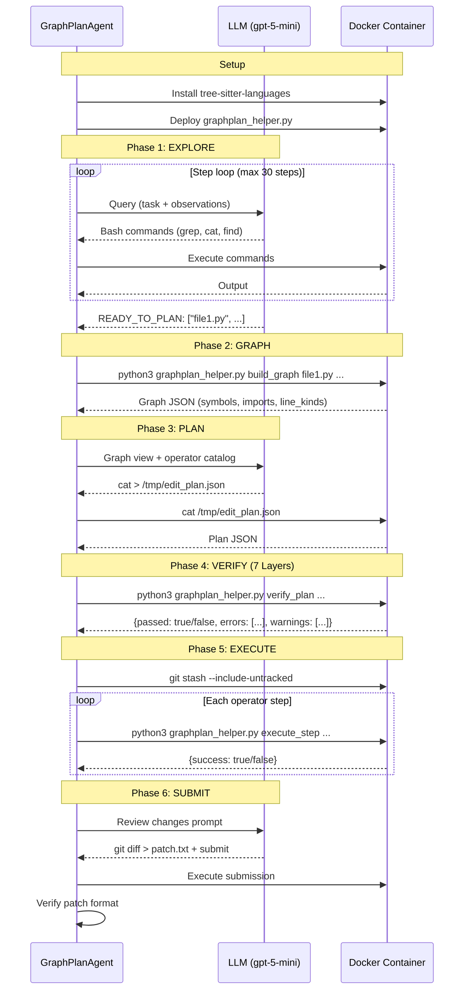

## Phase 1: Code Graph Construction

### What is the Code Graph?

The code graph is a lightweight structural representation of source files, built using **tree-sitter** via the `tree-sitter-languages` package. It captures three things:

1. **Symbols** - classes, functions, methods, structs, traits, interfaces, enums with their line ranges
2. **Imports** - module imports with line numbers (language-specific parsing)
3. **Line kinds** - structural markers (if/for/while/return/raise/try) at specific lines

### Supported Languages

| Language | Extensions | Symbol Types |
|----------|-----------|-------------|
| Python | `.py` | class, function |
| JavaScript | `.js`, `.jsx` | class, function, method, exported class/function |
| TypeScript | `.ts`, `.tsx` | class, function, method, interface, enum, type alias |
| Java | `.java` | class, method, interface, enum, constructor |
| Go | `.go` | function, method, type (struct) |
| Rust | `.rs` | function, struct, enum, trait, impl |
| Ruby | `.rb` | class, method, module, singleton method |
| PHP | `.php` | class, function, method, interface, trait |
| C | `.c`, `.h` | function, struct, enum, typedef |
| C++ | `.cpp`, `.cxx`, `.cc`, `.hpp`, `.hxx` | function, class, struct, enum, namespace |

### How it's Built

The helper script `graphplan_helper.py` runs **inside the Docker container**. It uses `tree-sitter-languages` for all supported languages. Each language has S-expression queries defined in `LANGUAGE_QUERIES` for extracting symbols and imports, plus `LINE_KIND_MAP` for normalizing control-flow node types.

```python
def build_graph_ts(file_paths):
    result = {"symbols": [], "imports": [], "line_kinds": {}, "errors": []}
    for fp in file_paths:
        lang = detect_language(fp)               # Extension -> language
        parser = get_parser(lang)                 # tree-sitter parser
        tree = parser.parse(open(fp, "rb").read())
        ts_lang = get_language(lang)

        # S-expression queries for symbols
        query = ts_lang.query(LANGUAGE_QUERIES[lang]["symbols"])
        captures = query.captures(tree.root_node)
        _extract_symbols_from_captures(captures, fp, lang, result)

        # S-expression queries for imports
        query = ts_lang.query(LANGUAGE_QUERIES[lang]["imports"])
        captures = query.captures(tree.root_node)
        _extract_imports_from_captures(captures, fp, lang, result)

        # Tree walk for line-level constructs
        _walk_for_line_kinds(tree.root_node, LINE_KIND_MAP[lang], file_line_kinds)
```

### tree-sitter Version Compatibility

The `tree-sitter-languages` package bundles pre-built parsers compiled against tree-sitter 0.20.x. tree-sitter 0.21+ changed `Language.__init__()` from `(path, name)` to `(ptr)`, breaking the Cython bindings. The agent pins `tree-sitter<0.21` to avoid this.

Installation uses a **functional verification** approach rather than a simple import check:


The functional check actually parses `def f(): pass` and runs an S-expression query, catching version mismatches at install time rather than during graph construction.

### Error Reporting

The graph builder reports errors explicitly rather than silently swallowing them:

```json
{
  "symbols": [...],
  "imports": [...],
  "line_kinds": {...},
  "errors": [
    "Cannot get parser for ruby (lib/foo.rb): ...",
    "Parse failed for src/broken.py: ..."
  ]
}
```

Each `try/except` block in the graph builder captures the error message and appends it to the `"errors"` list. The agent logs these errors and displays them in the console.

### tree-sitter API Version Handling

The `query.captures()` return type changed between tree-sitter versions:
- Older: `list[(Node, str)]` (list of tuples)
- Newer: `dict[str, list[Node]]` (dict of tag -> nodes)

The helper handles both via `_get_captures_list()`:

```python
def _get_captures_list(captures, tag):
    if isinstance(captures, dict):
        return captures.get(tag, [])
    return [n for n, name in captures if name == tag]
```

### Graph JSON Schema

```json
{
  "symbols": [
    {
      "name": "BaseSchema",
      "kind": "class",
      "file": "src/marshmallow/schema.py",
      "start_line": 45,
      "end_line": 920
    },
    {
      "name": "_invoke_field_validators",
      "kind": "function",
      "file": "src/marshmallow/schema.py",
      "start_line": 863,
      "end_line": 878
    }
  ],
  "imports": [
    {
      "file": "src/marshmallow/schema.py",
      "module": "marshmallow.utils",
      "symbol": "missing",
      "line": 12
    }
  ],
  "line_kinds": {
    "src/marshmallow/schema.py": {
      "863": "if_statement",
      "870": "for_statement",
      "875": "return_statement"
    }
  },
  "errors": []
}
```

### Graph View (LLM-Facing)

The raw JSON is transformed into a compact text view for the LLM:

```
FILE: src/marshmallow/schema.py
  IMPORT: from marshmallow.utils import missing [line 12]
  IMPORT: from marshmallow.fields import Field [line 13]
  CLASS: BaseSchema (lines 45-920)
  FUNCTION: __init__ (lines 50-78)
  FUNCTION: _invoke_field_validators (lines 863-878)
  FUNCTION: _invoke_schema_validators (lines 880-895)
```

This gives the LLM precise structural information (class names, function boundaries, import locations) without sending the entire source code. The LLM already read the source during the explore phase -- the graph view provides a structural map for planning.

## Phase 2: Edit Operators

### Operator Catalog

10 operators in two tiers. Each operator is a self-contained file transformation: read file, apply change, write file, syntax check.

#### Tier 1: Essential Operators

##### `replace_code` -- String Find-and-Replace

The workhorse operator. Handles the majority of fixes (single-point mutations, guard clause additions, condition changes).

| | |
|---|---|
| **Parameters** | `file` (path), `pattern` (exact string to find), `replacement` (string to substitute) |
| **Mechanism** | `content.replace(pattern, replacement, 1)` -- first occurrence only |
| **Precondition** | `pattern` must exist verbatim in the file content |
| **Runtime error** | `ValueError("Pattern not found in {file}: {pattern[:80]}")` |
| **Edge cases** | Pattern matching is literal (no regex). Newlines in pattern/replacement must use `\n`. Only replaces the *first* occurrence -- if the same pattern appears multiple times, subsequent occurrences require additional steps. |

```json
{"op": "replace_code", "params": {
  "file": "src/schema.py",
  "pattern": "for attr_name in self.__processors__",
  "replacement": "if data is None:\n            return\n        for attr_name in self.__processors__"
}}
```

##### `insert_code` -- Line-Anchored Insertion

Inserts code before or after a specific line number. Useful when the insertion point is known precisely from the graph view.

| | |
|---|---|
| **Parameters** | `file` (path), `anchor_line` (1-indexed), `position` (`"before"` or `"after"`), `code` (string to insert) |
| **Mechanism** | `lines.insert(idx, code)` at `anchor - 1` (before) or `anchor` (after) |
| **Precondition** | `anchor_line` must be in range `[1, num_lines]` |
| **Runtime error** | `ValueError("anchor_line {n} out of range (1-{total})")` |
| **Edge cases** | Trailing newline is auto-appended if missing. Position defaults to `"after"` if omitted. |

```json
{"op": "insert_code", "params": {
  "file": "src/query.py", "anchor_line": 847, "position": "after",
  "code": "    self._clear_cache()"
}}
```

##### `delete_lines` -- Range Deletion

Removes a contiguous range of lines. Both endpoints are inclusive and 1-indexed.

| | |
|---|---|
| **Parameters** | `file` (path), `start_line` (1-indexed), `end_line` (1-indexed, inclusive) |
| **Mechanism** | `del lines[start-1 : end]` |
| **Precondition** | `start_line <= end_line`, both in range `[1, num_lines]` |
| **Runtime error** | `ValueError("Line range {s}-{e} out of bounds (1-{total})")` |

```json
{"op": "delete_lines", "params": {
  "file": "src/query.py", "start_line": 50, "end_line": 53
}}
```

##### `add_method` -- Tree-Sitter-Guided Class Insertion

Adds a method to an existing class. Uses `_find_class_node_ts()` to locate the class boundaries via tree-sitter, then dispatches by language paradigm.

| | |
|---|---|
| **Parameters** | `file` (path), `class_name` (exact name), `method_code` (full method source with indentation) |
| **Mechanism** | **Python**: insert after last line of class body. **Brace-based**: scan backward from `end_line` for closing `}`, insert before it. |
| **Precondition** | Class `class_name` must exist in the file (verified against graph) |
| **Runtime error** | `ValueError("Class '{name}' not found in {file}")` |
| **Edge cases** | Trailing newline auto-appended. A blank line is prepended (`"\n" + method_code`) for readability. The LLM must provide correctly indented code. |
| **Tree-sitter nodes** | Searches: `class_definition`, `class_declaration`, `class_specifier`, `struct_specifier`, `interface_declaration`, `trait_item` |

```json
{"op": "add_method", "params": {
  "file": "src/query.py", "class_name": "QuerySet",
  "method_code": "    def _clear_cache(self):\n        self._cache = {}"
}}
```

##### `add_import` -- Import Statement Insertion

Inserts an import statement after the last existing import in the file. Language-agnostic heuristic.

| | |
|---|---|
| **Parameters** | `file` (path), `import_statement` (full import line) |
| **Mechanism** | Scan all lines for `import ` or `from ` prefixes, find last occurrence, insert after it. If no imports exist, insert at top after comments/docstrings. |
| **Precondition** | None (always succeeds) |
| **Edge cases** | Trailing newline auto-appended. Heuristic only matches Python-style `import`/`from` -- for other languages (e.g., `#include`, `use`), the LLM should use `insert_code` with an explicit line number instead. |

```json
{"op": "add_import", "params": {
  "file": "src/query.py",
  "import_statement": "from collections import OrderedDict"
}}
```

##### `modify_function_signature` -- Signature Replacement

Changes a function's def/declaration line. Uses string replacement, not tree-sitter.

| | |
|---|---|
| **Parameters** | `file` (path), `func_name` (for graph verification), `old_signature` (exact string), `new_signature` (replacement string) |
| **Mechanism** | `content.replace(old_signature, new_signature, 1)` |
| **Precondition** | Function `func_name` must exist in the graph. `old_signature` must exist in file content. |
| **Runtime error** | `ValueError("Old signature not found: {sig}")` |
| **Edge cases** | Multi-line signatures: `old_signature` must match exactly including indentation and newlines. |

```json
{"op": "modify_function_signature", "params": {
  "file": "src/query.py", "func_name": "defer",
  "old_signature": "def defer(self, *fields)",
  "new_signature": "def defer(self, *fields, clear_cache=True)"
}}
```

#### Tier 2: Structural Operators

##### `rename_symbol` -- Word-Boundary Rename

Renames all occurrences of a symbol within a single file using regex word boundaries.

| | |
|---|---|
| **Parameters** | `file` (path, must not be `"all"`), `old_name` (identifier), `new_name` (identifier) |
| **Mechanism** | `re.sub(r'\b' + re.escape(old_name) + r'\b', new_name, content)` |
| **Precondition** | `file` must not be `"all"` (cross-file rename is unsupported) |
| **Runtime error** | `ValueError("rename_symbol with file='all' requires explicit file listing")` |
| **Edge cases** | Word boundaries prevent partial matches (`_deferred` won't match `deferred`). `re.escape` handles special characters in the name. Replaces *all* occurrences in the file, not just the first. Doesn't distinguish definitions from references -- renames everything matching the boundary pattern. |

```json
{"op": "rename_symbol", "params": {
  "file": "src/query.py", "old_name": "_deferred", "new_name": "_deferred_fields"
}}
```

##### `wrap_block` -- Indentation-Aware Block Wrapping

Wraps a range of lines in a block structure (try/except, if/else, with statement, etc.). Auto-indents wrapped lines by 4 spaces.

| | |
|---|---|
| **Parameters** | `file` (path), `start_line` (1-indexed), `end_line` (1-indexed, inclusive), `before_code` (opening line, e.g. `"    try:"`), `after_code` (closing lines, e.g. `"    except ValueError:\n        pass"`) |
| **Mechanism** | Extract `lines[start-1:end]`, indent each non-empty line by 4 spaces, sandwich between `before_code` and `after_code`, replace original range. |
| **Precondition** | `start_line <= end_line` |
| **Edge cases** | Empty lines (whitespace-only) are *not* indented, preserving blank line aesthetics. Trailing newlines auto-appended to `before_code` and `after_code`. The indentation level of `before_code`/`after_code` must be specified by the LLM. |

```json
{"op": "wrap_block", "params": {
  "file": "src/query.py", "start_line": 50, "end_line": 55,
  "before_code": "    try:",
  "after_code": "    except ValueError:\n        pass"
}}
```

##### `add_class_attribute` -- Class-Level Attribute Insertion

Inserts a class-level attribute at the top of a class body. In Python, skips past any docstring.

| | |
|---|---|
| **Parameters** | `file` (path), `class_name` (exact name), `attribute_code` (full line with indentation) |
| **Mechanism** | **Python**: uses `_find_python_docstring_end_ts()` to locate the docstring end, inserts after it. If no docstring, inserts at `body_start`. **Brace-based**: inserts right after the opening `{` line. |
| **Precondition** | Class `class_name` must exist in the file (verified against graph) |
| **Runtime error** | `ValueError("Class '{name}' not found in {file}")` |
| **Tree-sitter nodes** | Python docstring detection: walks `class_definition` -> `body` -> first child, checks for `expression_statement` containing `string` node. |

```json
{"op": "add_class_attribute", "params": {
  "file": "src/query.py", "class_name": "QuerySet",
  "attribute_code": "    _deferred_cache = None"
}}
```

##### `replace_function_body` -- Full Body Replacement

Replaces the entire body of a function. Uses `_find_function_node_ts()` to locate the function boundaries via tree-sitter.

| | |
|---|---|
| **Parameters** | `file` (path), `func_name` (exact name), `new_body` (replacement source with indentation) |
| **Mechanism** | **Python**: `lines[body_start-1 : body_end] = [new_body]` -- replaces the tree-sitter `block` node content. **Brace-based**: replaces content between `{` and `}`. For single-line bodies (`{ return x; }`), reconstructs as multi-line. |
| **Precondition** | Function `func_name` must exist in the file (verified against graph) |
| **Runtime error** | `ValueError("Function '{name}' not found in {file}")` |
| **Tree-sitter nodes** | Searches: `function_declaration`, `function_definition`, `method_declaration`, `method_definition`, `function_item`, `constructor_declaration`. For C/C++, also traverses `declarator` -> nested `declarator` to find the name. |

```json
{"op": "replace_function_body", "params": {
  "file": "src/query.py", "func_name": "_clear_cache",
  "new_body": "        self._cache = {}\n        self._result_cache = None"
}}
```

### Operator Classification

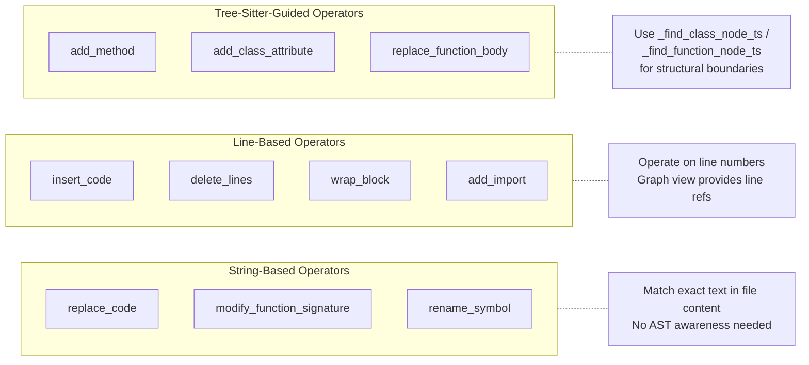

### Multi-Language Operator Dispatch

Three operators use tree-sitter for structural navigation: `add_method`, `add_class_attribute`, `replace_function_body`. These dispatch based on language:

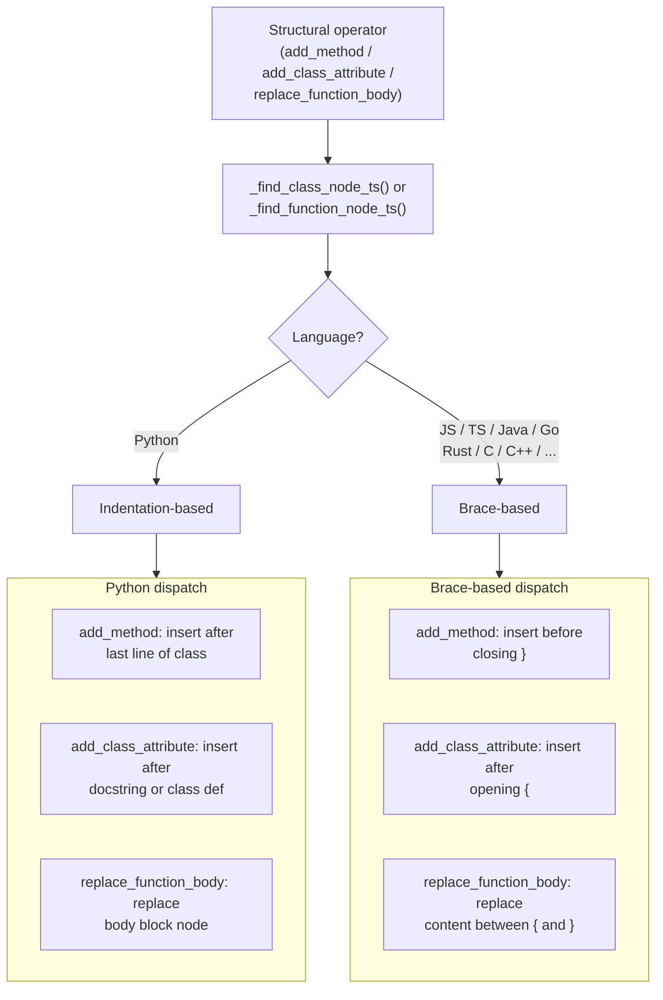

Node finders search for language-specific AST node types:
- `_find_class_node_ts`: `class_definition`, `class_declaration`, `class_specifier`, `struct_specifier`, `interface_declaration`, `trait_item`
- `_find_function_node_ts`: `function_declaration`, `function_definition`, `method_declaration`, `method_definition`, `function_item`, `constructor_declaration`

### Plan Format

The LLM outputs a JSON array of operator steps:

```json
[
  {
    "op": "replace_code",
    "params": {
      "file": "src/marshmallow/schema.py",
      "pattern": "for attr_name in self.__processors__",
      "replacement": "if data is None:\n            return\n        for attr_name in self.__processors__"
    }
  },
  {
    "op": "add_import",
    "params": {
      "file": "src/marshmallow/schema.py",
      "import_statement": "from marshmallow.exceptions import ValidationError"
    }
  }
]
```

### Plan Validation

Extracted JSON arrays are validated with `_is_valid_plan()` to prevent non-plan data (like file lists from `READY_TO_PLAN` markers) from being treated as edit plans:

```python
@staticmethod
def _is_valid_plan(plan: list) -> bool:
    if not isinstance(plan, list) or len(plan) == 0:
        return False
    return isinstance(plan[0], dict) and "op" in plan[0]
```

This rejects `["src/foo.py", "src/bar.py"]` while accepting `[{"op": "replace_code", "params": {...}}]`.

### How the LLM Writes the Plan

The LLM model always requires bash tool calls (enforced by LitellmModel). So the plan generation phase instructs the LLM to write the JSON plan to a file via bash:

```bash
cat > /tmp/edit_plan.json << 'PLAN_EOF'
[{"op": "replace_code", "params": {"file": "...", ...}}]
PLAN_EOF
```

The agent then reads `/tmp/edit_plan.json` from the container. This naturally satisfies the tool-call requirement while capturing structured plan data. If the file isn't written, the agent:
1. Scans message content for JSON as a fallback (with `_is_valid_plan` validation)
2. Nudges the LLM to write the file (up to 5 attempts)
3. Falls back to standard step loop if plan generation fails entirely

## Phase 3: Plan Verification -- The 7-Layer System

### Honest Assessment

The plan verification system is **not** formal verification in the academic sense. It does not provide mathematical proofs of correctness, and it cannot guarantee that a plan will produce a semantically valid transformation. However, it now covers 7 layers of pre-execution checking that catch the most common failure modes:

```mermaid
flowchart LR
    subgraph Actually ["What We Actually Have"]
        A1["Schema validation<br/><i>valid op, required params</i>"]
        A2["Referential integrity<br/><i>symbols exist in graph</i>"]
        A3["Bounds checking<br/><i>line numbers in range</i>"]
        A4["Pattern existence<br/><i>pre-check + fuzzy match</i>"]
        A5["Line drift detection<br/><i>cumulative shift warnings</i>"]
        A6["AST context checking<br/><i>string/comment detection</i>"]
        A7["Scope analysis<br/><i>def/ref/string classification</i>"]
        A8["Preflight syntax<br/><i>simulated replacement check</i>"]
        A9["Cross-file impact<br/><i>import graph analysis</i>"]
    end

    subgraph Not ["What We Don't Have"]
        N1["Semantic verification<br/><i>no type checking,<br/>no reference resolution</i>"]
        N2["Behavioral proof<br/><i>no guarantee the fix<br/>actually solves the bug</i>"]
    end

    style Actually fill:#1a3a2a,stroke:#2d6a4f
    style Not fill:#3a1a1a,stroke:#6a2d2d
```

| What we call it | What it really is | What formal verification would require |
|---|---|---|
| "Precondition verification" | **Schema validation** + **referential integrity** + **content pre-checks** + **line drift analysis** + **AST context** + **scope classification** + **cross-file impact** | Proving the transformation preserves program semantics |
| "Postcondition validation" | **Syntax linting** (no parse errors after edit) + **preflight simulation** (check before writing) | Proving the output satisfies a specification |
| `replace_code` pattern match | **Pre-checked**: exact match verified, fuzzy fallback with similarity score, AST context check, preflight syntax simulation | Pattern would need to reference AST nodes, not raw text |
| `_syntax_check()` | Parse tree has no ERROR nodes (both post-execution and pre-flight) | Would need type checking, data-flow analysis |

### The Semantic Gap (Narrowed)

The most-used operator, `replace_code`, depends entirely on an LLM-provided `pattern` string. This is a **content-dependent, semantic match** -- not a structural one. However, with the 7-layer system, these content-dependent operators now have **pre-execution verification** that catches most failures:

```mermaid
flowchart TD
    subgraph Structural ["Structurally Verifiable (graph + bounds)"]
        S1["add_method: class 'QuerySet'<br/>exists in graph? YES"]
        S2["replace_function_body: func<br/>'_clear_cache' exists? YES"]
        S3["insert_code: line 847<br/>in range 1-920? YES"]
    end

    subgraph Content ["Content-Verified (Layers 1, 3, 5)"]
        R1["replace_code: pattern exists<br/>in file? Checked pre-execution.<br/>Fuzzy match if not exact."]
        R2["modify_function_signature:<br/>old_signature exists? Checked."]
        R3["Replacement produces valid<br/>syntax? Preflight simulated."]
    end

    subgraph Remaining ["Remaining Semantic Gap"]
        G1["Does the fix actually<br/>solve the bug?"]
        G2["Are all callers updated<br/>for signature changes?"]
    end

    S1 -.- Note1["Graph + bounds checks"]
    R1 -.- Note2["Content pre-checks<br/>+ fuzzy match + AST context<br/>+ preflight syntax"]
    G1 -.- Note3["Only tests can verify<br/>behavioral correctness"]

    style Structural fill:#1a3a2a,stroke:#2d6a4f
    style Content fill:#2a3a1a,stroke:#4f6a2d
    style Remaining fill:#3a2a1a,stroke:#6a4f2d
```

**All 10 operators** now have pre-execution verification. The 4 previously "runtime-only" operators are now content-verified:

| Operator | Previously Unverifiable | Now Verified By |
|----------|----------------------|------------------|
| `replace_code` | `pattern` | **Layer 1** (exact + fuzzy match), **Layer 3** (AST context), **Layer 5** (preflight syntax) |
| `modify_function_signature` | `old_signature` | **Layer 1** (exact match check) |
| `rename_symbol` | `old_name` | **Layer 1** (word-boundary check), **Layer 4** (scope classification), **Layer 6** (cross-file impact) |
| `add_import` | `import_statement` | **Layer 1** (duplication detection -- warning) |

**6 of 10 operators** remain structurally verifiable via the graph (unchanged):

| Operator | Verifiable precondition | How |
|----------|------------------------|-----|
| `add_method` | `class_name` exists + duplicate check | Graph symbol lookup + **Layer 1** method name check |
| `add_class_attribute` | `class_name` exists | Graph symbol lookup: `kind == "class"` |
| `replace_function_body` | `func_name` exists | Graph symbol lookup: `kind == "function"` |
| `modify_function_signature` | `func_name` exists + `old_signature` exists | Graph + **Layer 1** content check |
| `insert_code` | `anchor_line` in range | File line count + **Layer 2** drift detection |
| `delete_lines` | `start_line <= end_line`, in bounds + impact check | File line count + **Layer 2** drift + **Layer 6** cross-file |

### What the Verification Actually Checks

The `verify_plan()` function runs inside the Docker container, receives the plan JSON and graph JSON, and checks every step against **7 layers**. Errors block execution; warnings are displayed but don't block. All new layers degrade gracefully when tree-sitter is unavailable.

#### Layer 0: Structural Checks (Schema + File + Graph + Bounds)

Every step must have a valid operator name, all required parameters, target an existing file, reference valid graph symbols, and use valid line ranges.

| Check | Rule | Error format |
|-------|------|-------------|
| Operator name | `op in VALID_OPS` (set of 10) | `"Step {i}: Unknown operator '{op}'"` |
| Required params | All keys in `REQUIRED_PARAMS[op]` present | `"Step {i}: Missing parameter '{p}' for {op}"` |
| File exists | `os.path.isfile(file_path)` | `"Step {i}: File '{path}' does not exist"` |
| Symbol in graph | Class/function exists with correct kind and file | `"Step {i} ({op}): Class/Function '{name}' not found"` |
| Line range valid | `anchor_line` in range, `start_line <= end_line` | `"anchor_line {n} out of range"` / `"start_line > end_line"` |

**What this catches:** Hallucinated operators, missing parameters, nonexistent files/symbols, out-of-bounds lines.

#### Layer 1: Content Existence Pre-Check

For every operator that depends on finding specific text in a file, verifies that the text actually exists **before beginning execution**. Uses `_fuzzy_find()` (difflib-based) for near-match detection.

| Operator | Check | Result |
|----------|-------|--------|
| `replace_code` | `pattern in content` | **Error** if not found (with fuzzy match **warning** if >80% similar) |
| `modify_function_signature` | `old_signature in content` | **Error** if not found |
| `rename_symbol` | `\b{old_name}\b` regex match | **Error** if not found |
| `add_import` | `import_statement.strip() in content` | **Warning** if already present (duplicate) |
| `add_method` | `def {method_name}(` regex in content | **Warning** if method name already exists |

```python
# Fuzzy match example
if pattern not in content:
    ratio, matched = _fuzzy_find(content, pattern)
    if ratio > 0.8:
        warnings.append(f"Step {i}: pattern not found exactly, "
                        f"but {ratio:.0%} similar match: {matched[:60]}...")
    else:
        errors.append(f"Step {i}: pattern not found in {file_path}")
```

**What this catches**: The single most common failure mode -- `replace_code` pattern does not exist because the LLM hallucinated the exact text. Previously caught only at runtime after earlier steps may have already modified files.

#### Layer 2: Cross-Step Line Drift Detection

Simulates the line-number impact of each step on subsequent steps targeting the same file. Groups steps by file, walks in order, computes cumulative drift:

| Operation | Drift |
|-----------|-------|
| `insert_code` | +N lines (code.count('\n') + 1) |
| `delete_lines` | -(end - start + 1) |
| `wrap_block` | +2 minimum (before_code + after_code) |
| `add_method` | +N lines at class end |
| `add_import` | +1 |
| `add_class_attribute` | +1 |
| `replace_code` | +(new_lines - old_lines) |

For each step using line numbers (`insert_code`, `delete_lines`, `wrap_block`), if cumulative drift != 0, emits a **warning** with drift amount.

```
WARNING: Step 3 (delete_lines): line numbers may be off by +3 lines due to earlier edits on src/schema.py
```

**What this catches**: Step 1 inserts 3 lines before line 50, Step 2 tries to `delete_lines(52, 55)` -- now those lines point to the wrong code.

#### Layer 3: AST Pattern Context Check

When a `replace_code` pattern is found in the file, checks whether the match falls inside a string literal or comment AST node. Uses tree-sitter to find the deepest node at the match position and walks ancestors checking for string/comment types.

Detected node types: `string`, `comment`, `string_literal`, `template_string`, `line_comment`, `block_comment`, `string_content`, `string_fragment`, `heredoc_body`, `regex`, etc.

```
WARNING: Step 0 (replace_code): Pattern match in src/foo.py at offset 42 is inside a string node (may not be actual code)
```

**What this catches**: Patterns that accidentally match inside string literals or comments rather than actual code.

**Graceful degradation**: Returns None (no warning) if tree-sitter is unavailable.

#### Layer 4: Symbol Occurrence Scope Analysis

For `rename_symbol`, classifies all occurrences of the symbol in the file:

| Classification | Description |
|---------------|-------------|
| `definitions` | Symbol is the `name` field of a definition node |
| `references` | Symbol used in code context |
| `in_strings` | Symbol appears inside a string literal |
| `in_comments` | Symbol appears inside a comment |

If `in_strings > 0` or `in_comments > 0`, emits a **warning** since regex rename will change these too.

```
WARNING: Step 2 (rename_symbol): 'old_name' also appears in strings (2x) and comments (1x) -- regex rename will change these too
```

**What this catches**: Renaming `data` to `result` also corrupts `"Enter your data:"`.

**Graceful degradation**: Returns None if tree-sitter is unavailable.

#### Layer 5: Preflight Syntax Simulation

For `replace_code`, simulates the replacement in memory (without writing to disk) and checks the result for syntax errors via tree-sitter:

```python
if pattern in content:
    simulated = content.replace(pattern, replacement, 1)
    ok, err = _syntax_check_content(simulated, file_path)
    if not ok:
        errors.append(f"Step {i} (replace_code): {err}")
```

**What this catches**: Replacement text that breaks syntax -- caught before any file is modified.

**Graceful degradation**: Returns (True, None) if tree-sitter is unavailable.

#### Layer 6: Cross-File Impact Analysis

Builds an import relationship graph from the code graph data and checks whether modified symbols are imported by files not included in the plan:

| Operation | Check |
|-----------|-------|
| `rename_symbol` | Is `old_name` imported by files not in the plan? |
| `modify_function_signature` | Is `func_name` imported by files not in the plan? |
| `delete_lines` | Do deleted lines contain symbols imported elsewhere? |

```
WARNING: Step 1 (rename_symbol): 'helper_func' is imported by files not in this plan: ['other.py', 'test.py']
```

**What this catches**: Renaming a symbol or changing a signature breaks importers in other files.

#### Plan Integrity Gate

Before verification begins, the plan JSON is validated:

```python
@staticmethod
def _is_valid_plan(plan: list) -> bool:
    if not isinstance(plan, list) or len(plan) == 0:
        return False
    return isinstance(plan[0], dict) and "op" in plan[0]
```

Rejects empty arrays, file lists (`["src/foo.py"]`), and non-dict arrays.

### Runtime Guards (During Execution)

What static verification can't catch, runtime guards handle. These are **not verification** -- they are fail-fast error handling with rollback.

#### Per-Operator Runtime Guards

| Operator | Runtime guard | Failure mode |
|----------|--------------|-------------|
| `replace_code` | `pattern in content` | `ValueError("Pattern not found")` -- **this is the most common failure** |
| `modify_function_signature` | `old_signature in content` | `ValueError("Old signature not found")` |
| `add_method` | `_find_class_node_ts()` returns result | `ValueError("Class not found")` |
| `add_class_attribute` | `_find_class_node_ts()` returns result | `ValueError("Class not found")` |
| `replace_function_body` | `_find_function_node_ts()` returns result | `ValueError("Function not found")` |
| `insert_code` | `anchor_line` in `[1, len(lines)]` | `ValueError("out of range")` |
| `delete_lines` | Range in bounds | `ValueError("out of bounds")` |
| `rename_symbol` | `file != "all"` | `ValueError("requires explicit file")` |
| `add_import` | None | Always succeeds |
| `wrap_block` | None | Always succeeds |

#### Universal Postcondition: Syntax Check

After every operator, `_syntax_check()` parses the modified file:

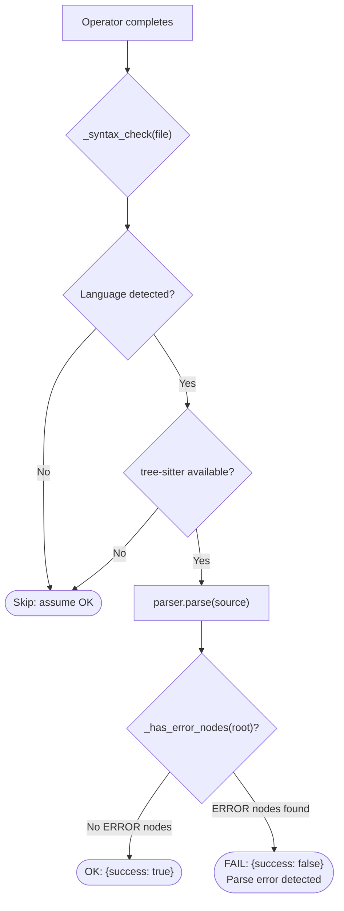

**What this catches:** Replacement text that breaks syntax (mismatched brackets, bad indentation, incomplete statements).

**What this misses:** Semantically invalid code that parses correctly (undefined variables, wrong types, logic errors).

### Verification Output Format

```json
{
  "passed": false,
  "errors": [
    "Step 0 (replace_code): Pattern not found in src/schema.py: 'for attr_name in self.__proc...'",
    "Step 2 (replace_code): Replacement produces syntax error in src/schema.py",
    "Step 3: Missing parameter 'pattern' for replace_code"
  ],
  "warnings": [
    "Step 1 (replace_code): Pattern not found exactly, but 92% similar match found: 'for attr in self.__processors...'",
    "Step 2 (rename_symbol): 'data' also appears in strings (2x) and comments (1x) -- regex rename will change these too",
    "Step 4 (delete_lines): line numbers may be off by +3 lines due to earlier edits on src/schema.py",
    "Step 5 (rename_symbol): 'helper_func' is imported by files not in this plan: ['views.py']"
  ]
}
```

All errors and warnings are collected (not short-circuited), so the LLM sees every problem in one revision prompt. **Errors** block execution (`passed = false`). **Warnings** are displayed in yellow in the console but don't block execution.

### Revision Loop

When verification fails, the agent feeds errors back to the LLM:


Up to `max_plan_revisions` (default: 3) attempts before falling back.

### Summary: Verification Strength by Operator

With the 7-layer system, all 10 operators now have pre-execution verification:


### How Other Tools Handle This Problem

Before designing improvements, it's worth understanding how existing code transformation tools approach pattern matching, verification, and cross-step dependencies.

#### Coccinelle (Semantic Patches for C)

Coccinelle parses source code into intraprocedural control-flow graphs (CFGs), then compiles SmPL (Semantic Patch Language) patterns into CTL-VW (Computational Tree Logic with Variables and Witnesses) formulas. The CTL formula is model-checked against the CFG. Key concepts:

- **Isomorphisms**: Automatically considers semantically equivalent forms. Matching `(x==NULL)` also tries `(!x)`, `(NULL==x)`, etc. Eliminates false negatives from syntactic variation.
- **Scope via Paren(x)**: Constrains searches to specific function definition bodies, preventing accidental matches across scopes.
- **All-paths default**: A SmPL rule must match ALL control flow paths, preventing partial transforms.

**What we can steal**: The isomorphism concept (define equivalences for common Python patterns) and scope constraints for `rename_symbol`.

#### Comby (Structural Search/Replace)

Comby uses lightweight structural matching that understands balanced delimiters, string boundaries, and comment boundaries per language. Patterns use `:[hole]` holes that match lazily.

- **Balanced delimiter enforcement**: `f(:[args])` correctly matches `f(g(x), y)` without stopping at the first `)`.
- **Whitespace insensitivity**: Single/multiple spaces and newlines in templates are equivalent.
- **Language-aware boundaries**: Prevents false matches inside string literals or comments.

**What we can steal**: Whitespace-insensitive matching for `replace_code` -- the single highest-impact improvement. Currently `str.replace()` demands exact match; Comby's approach tolerates formatting differences.

#### ast-grep (Tree-sitter Structural Search)

ast-grep parses code into Concrete Syntax Trees via tree-sitter, then matches patterns against tree structure. Patterns look like ordinary code with meta-variables (`$VAR`, `$$VAR`, `$$$VAR`).

- **Kind constraints**: Meta-variables can be constrained by AST node kind (identifier vs string).
- **Relational rules**: `has`, `inside`, `follows`, `precedes` specify structural context.
- **Regex bridge**: Text-level matching on specific AST nodes.

**What we can steal**: Since we already have tree-sitter, ast-grep's pattern language is the most natural fit for structural matching. Could serve as foundation for AST-level pattern verification.

#### CodePlan (Microsoft, FSE 2024)

CodePlan frames repository-level coding as a planning problem with a dynamic, adaptive plan DAG.

- **Incremental dependency analysis**: After each edit, updates the dependency graph (imports, method calls, inheritance).
- **Change may-impact analysis**: When a method body is edited, escape analysis determines if callers are affected. Signature changes flag all callers for updates.
- **Adaptive plan graph**: Each node is a "code edit obligation." The graph grows dynamically as edits reveal new obligations.

**What we can steal**: The distinction between "localized" edits (body-only) and "escaping" edits (signature changes, renames). Escaping edits should be ordered last or trigger re-verification.

#### Aider (Layered Fuzzy Matching)

Aider uses SEARCH/REPLACE blocks with a layered fallback strategy:

1. **Exact match** -- direct string comparison
2. **Whitespace-insensitive match** -- normalize whitespace before comparison
3. **Indentation-preserving match** -- strip leading indentation uniformly
4. **Fuzzy match via difflib** -- `SequenceMatcher` with similarity threshold

**What we can steal**: Directly implementable as an enhancement to `_exec_replace_code()`. Replace the current `str.replace()` with a layered approach. This is the highest-leverage, lowest-effort improvement.

### The 7-Layer Verification Model

All 7 layers are now implemented. Layers 3, 4, 5 gracefully degrade when tree-sitter is unavailable.

```mermaid
flowchart TD
    subgraph Implemented ["All Layers Implemented"]
        L0["Layer 0: Schema Validation<br/><i>valid op, required params,<br/>file exists, symbol in graph</i>"]
        L1["Layer 1: Content Existence<br/><i>pattern pre-check + fuzzy match<br/>duplicate detection</i>"]
        L2["Layer 2: Line Drift Detection<br/><i>cumulative shift warnings<br/>per-file tracking</i>"]
        L3["Layer 3: AST Pattern Context<br/><i>string/comment detection<br/>via tree-sitter</i>"]
        L4["Layer 4: Scope Analysis<br/><i>def/ref/string/comment<br/>classification</i>"]
        L5["Layer 5: Preflight Syntax<br/><i>simulated replacement<br/>syntax check</i>"]
        L6["Layer 6: Cross-File Impact<br/><i>import graph analysis<br/>affected file detection</i>"]
    end

    L0 --> L1 --> L2
    L3 --> L4 --> L5 --> L6

    L0 -.- E0(["errors block execution"])
    L1 -.- E1(["errors block, fuzzy matches warn"])
    L2 -.- W2(["warnings only"])
    L3 -.- W3(["warnings only, degrades gracefully"])
    L4 -.- W4(["warnings only, degrades gracefully"])
    L5 -.- E5(["errors block, degrades gracefully"])
    L6 -.- W6(["warnings only"])

    style Implemented fill:#1a3a2a,stroke:#2d6a4f
```

#### Layer 0: Schema Validation

| Check | What it catches | Severity |
|-------|----------------|----------|
| Valid op name | Hallucinated operators (`edit_file`, `patch_code`) | Error |
| Required params | Missing parameters that crash at runtime | Error |
| File exists | Hallucinated file paths, typos | Error |
| Symbol in graph | Hallucinated class/function names | Error |
| Line range valid | Out-of-bounds line numbers, inverted ranges | Error |

#### Layer 1: Content Existence Pre-Check

Implemented via `_fuzzy_find()` (difflib-based sliding window) and `_extract_method_name()` (regex-based name extraction).

| Operator | Check | Severity |
|----------|-------|----------|
| `replace_code` | Pattern exists in file content | Error (or warning if >80% fuzzy match) |
| `modify_function_signature` | Old signature exists in file content | Error |
| `rename_symbol` | Old name exists as word-boundary match | Error |
| `add_import` | Import already present (duplicate guard) | Warning |
| `add_method` | Method name already exists in file | Warning |

**What this catches**: The single most common failure mode -- `replace_code` pattern mismatch.

#### Layer 2: Cross-Step Line Drift Analysis

Implemented via `_check_line_drift()`. Groups steps by file, walks in order, computes cumulative drift from line-changing operations.

| Operation | Drift Computation |
|-----------|------------------|
| `insert_code` | +N lines (code.count('\n') + 1) |
| `delete_lines` | -(end - start + 1) |
| `wrap_block` | +before_lines + after_lines |
| `add_method` | +N lines + 2 |
| `add_import` / `add_class_attribute` | +1 |
| `replace_code` | +(new_lines - old_lines) |

Emits **warnings** (not errors) when a line-number-dependent step has non-zero drift.

#### Layer 3: AST Pattern Context Check

Implemented via `_check_pattern_ast_context()`. When a `replace_code` pattern is found, checks whether the match position falls inside a string or comment AST node.

Uses tree-sitter to find the deepest node at the match byte offset, then walks ancestors checking against a universal set of string/comment node types. Emits a **warning** if the pattern is inside non-code context.

**Graceful degradation**: Returns None (no warning) if tree-sitter is unavailable.

#### Layer 4: Scope Analysis

Implemented via `_classify_symbol_occurrences()`. For `rename_symbol`, walks the AST and classifies every identifier matching the symbol name:

| Classification | Detection Method |
|---------------|-----------------|
| `definitions` | Identifier is the `name` field of a definition node |
| `references` | Identifier in code context (not string/comment/definition) |
| `in_strings` | Ancestor is a string-type node |
| `in_comments` | Ancestor is a comment-type node |

Emits a **warning** with counts when `in_strings > 0` or `in_comments > 0`.

**Graceful degradation**: Returns None if tree-sitter is unavailable.

#### Layer 5: Preflight Syntax Simulation

Implemented via `_syntax_check_content()`. For `replace_code`, simulates the replacement in memory (content.replace) and parses the result with tree-sitter to check for ERROR nodes -- **before writing to disk**.

Emits an **error** (blocks execution) if the simulated replacement produces a syntax error.

**Graceful degradation**: Returns (True, None) if tree-sitter is unavailable.

#### Layer 6: Cross-File Impact Analysis

Implemented via `_build_import_graph()`. Builds two maps from graph data:
- `symbol_importers`: symbol_name -> set of files that import it
- `file_exports`: file_path -> set of symbol names it defines

Checks each step for cross-file impact:
- `rename_symbol`: if `old_name` has importers not in plan -> warning
- `modify_function_signature`: if `func_name` has importers not in plan -> warning
- `delete_lines`: if deleted range overlaps a symbol imported elsewhere -> warning

### Operator-by-Operator Silent Failure Analysis

Each operator has specific failure modes that are **silent** (no error raised, but wrong code produced) or **late** (error raised only at execution time, after earlier steps have modified files). The table maps each failure to the verification layer that now catches it. Entries marked with a checkmark are implemented.

#### `replace_code`

| Silent Failure | Description | Caught By | Status |
|---|---|---|---|
| Pattern not found | LLM hallucinated text; `str.replace` gets no match | **Layer 1** (pre-check + fuzzy) | Implemented |
| Wrong occurrence | File has multiple matches; first is replaced, not intended one | **Layer 3** (AST context) | Partial (warns if in string/comment) |
| Whitespace mismatch | Pattern has `\t` but file has spaces, or trailing whitespace | **Layer 1** (fuzzy match) | Implemented |
| Pattern in string/comment | Matches inside a string literal, corrupts it | **Layer 3** (AST node type) | Implemented |
| Replacement creates syntax error | Valid pattern found, replacement is malformed | **Layer 5** (preflight syntax) | Implemented |

#### `insert_code`

| Silent Failure | Description | Caught By | Status |
|---|---|---|---|
| Anchor shifted by prior step | Earlier insert shifted lines, anchor now wrong | **Layer 2** (drift) | Implemented (warning) |
| Duplicate insertion | Same code inserted twice on retry | -- | Not implemented |
| Wrong semantic location | Anchor is mid-expression | -- | Not implemented |

#### `delete_lines`

| Silent Failure | Description | Caught By | Status |
|---|---|---|---|
| Lines shifted by prior step | Earlier changes shifted lines, now deleting wrong code | **Layer 2** (drift) | Implemented (warning) |
| Partial construct deleted | Deleting lines 50-53 of a 50-60 function leaves it broken | **Layer 5** (post-exec syntax) | Implemented (post-exec) |
| Symbol still imported | Deleting a symbol used by other files | **Layer 6** (cross-file impact) | Implemented (warning) |

#### `rename_symbol`

| Silent Failure | Description | Caught By | Status |
|---|---|---|---|
| Name not in file | Old name doesn't exist as word-boundary match | **Layer 1** (pre-check) | Implemented |
| Renames in strings | `"old_name"` becomes `"new_name"` | **Layer 4** (string classification) | Implemented (warning) |
| Renames in comments | `# old_name does X` corrupted | **Layer 4** (comment classification) | Implemented (warning) |
| Wrong scope | Local variable in unrelated function renamed | **Layer 4** (partial scope) | Partial (counts but doesn't prevent) |
| Shadowed variable | Inner function's local also renamed | -- | Not implemented |
| Name collision | `new_name` already exists in scope | -- | Not implemented |
| Cross-file breakage | Other files import `old_name` | **Layer 6** (cross-file impact) | Implemented (warning) |

#### `modify_function_signature`

| Silent Failure | Description | Caught By | Status |
|---|---|---|---|
| Old signature not found | Whitespace/formatting mismatch | **Layer 1** (pre-check) | Implemented |
| Callers not updated | Signature change requires call site updates | **Layer 6** (cross-file impact) | Implemented (warning) |

#### `add_method` / `add_class_attribute`

| Silent Failure | Description | Caught By | Status |
|---|---|---|---|
| Duplicate method name | Class already has method with that name | **Layer 1** (pre-check) | Implemented (warning) |

#### `wrap_block`

| Silent Failure | Description | Caught By | Status |
|---|---|---|---|
| Lines shifted by prior step | Line numbers wrong | **Layer 2** (drift) | Implemented (warning) |

### Implementation Status

All 7 layers are implemented. The helper functions and expanded `verify_plan()` add ~250 lines to `graph_plan_scripts.py`.

```mermaid
flowchart LR
    subgraph Done ["All Layers Implemented"]
        direction TB
        P1["Layer 1: Pattern Pre-Check<br/><i>_fuzzy_find + _extract_method_name<br/>~35 lines</i>"]
        P2["Layer 2: Line Drift Analysis<br/><i>_check_line_drift<br/>~80 lines</i>"]
        P3["Layer 3: AST Context Check<br/><i>_check_pattern_ast_context<br/>~50 lines</i>"]
        P4["Layer 4: Scope Analysis<br/><i>_classify_symbol_occurrences<br/>~60 lines</i>"]
        P5["Layer 5: Preflight Syntax<br/><i>_syntax_check_content<br/>~15 lines</i>"]
        P6["Layer 6: Cross-File Impact<br/><i>_build_import_graph<br/>~30 lines</i>"]
    end

    style Done fill:#1a3a2a,stroke:#2d6a4f
```

| Layer | Helper Function(s) | Lines | Dependencies |
|---|---|---|---|
| Layer 1 | `_fuzzy_find()`, `_extract_method_name()` | ~35 | `difflib` (stdlib) |
| Layer 2 | `_check_line_drift()` | ~80 | None |
| Layer 3 | `_check_pattern_ast_context()` | ~50 | tree-sitter (optional) |
| Layer 4 | `_classify_symbol_occurrences()` | ~60 | tree-sitter (optional) |
| Layer 5 | `_syntax_check_content()` | ~15 | tree-sitter (optional) |
| Layer 6 | `_build_import_graph()` | ~30 | None |

All tree-sitter-dependent layers (3, 4, 5) degrade gracefully when tree-sitter is unavailable -- they return success/None and emit no warnings. The `difflib` import is stdlib and available in all Docker containers.

### Key Architectural Insight: Static vs Adaptive Plans

The most important lesson from CodePlan (Microsoft) is the distinction between **static plans** (generate complete plan, execute sequentially) and **adaptive plans** (plan grows/changes as edits reveal new impacts).

Our current system uses a static plan with comprehensive pre-execution verification. Two pragmatic adaptations that could further improve reliability without requiring a full dynamic planning system:

1. **Re-verify after each step**: After executing step N, re-run Layers 1-2 on steps N+1, N+2, ... to check that their assumptions still hold. If not, trigger plan revision for remaining steps only.

2. **Classify edits by escape risk**: `replace_code` with a body-only change is **localized** (only affects replaced text). `rename_symbol` is **escaping** (affects all references). `modify_function_signature` is **escaping** (affects all callers). Layer 6's cross-file impact analysis now detects escaping edits, but doesn't yet reorder them.

### Remaining Gaps

With all 7 layers implemented, the remaining gaps are:

| Gap | Description | Difficulty |
|-----|-------------|------------|
| Adaptive re-verification | Re-run layers after each step execution | Medium |
| Scope-aware rename execution | Actually skip string/comment occurrences during rename (currently just warns) | Medium |
| Shadow detection | Detect when `rename_symbol` affects shadowed variables in nested scopes | High |
| Full AST structural matching | Whitespace-insensitive tree matching for `replace_code` patterns | High |
| Behavioral verification | Prove the fix actually solves the bug (fundamentally impossible without tests) | N/A |

### Summary

The verification system provides **7 layers of defensive checking**: schema validation, content existence with fuzzy matching, line drift detection, AST context analysis, scope classification, preflight syntax simulation, and cross-file impact analysis. Errors block execution; warnings inform the LLM and operator but allow the plan to proceed.

The system catches the most common failure modes before any files are modified:
- **Pattern not found** (Layer 1) -- the single most common execution failure
- **Line drift** (Layer 2) -- the second most dangerous failure class
- **Syntax-breaking replacement** (Layer 5) -- caught before writing to disk
- **Cross-file breakage** (Layer 6) -- warned before execution

Behavioral correctness (whether the fix actually solves the bug) can only be verified by running tests externally after the agent finishes.

## Phase 4: Execution with Postcondition Validation

### Execution Flow

Each operator step executes sequentially:

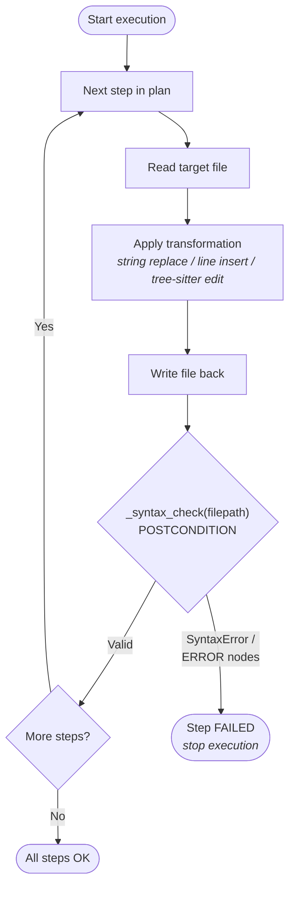

### Execution Rollback

The agent uses `git stash` for transactional safety:

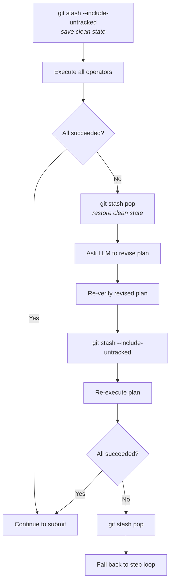

## Phase 5: Post-Submission Patch Verification

After submission, the agent verifies patch format (without running any tests):
- `diff --git` header present
- `--- a/` and `+++ b/` markers present
- `@@` hunk markers present
- Contains actual additions (`+` lines)
- `git apply --check` passes (dry-run)

Test evaluation (FAIL_TO_PASS / PASS_TO_PASS) is performed externally by the SWE-bench evaluation harness after the agent has finished. The agent never sees test results during its run.

## Invariants Maintained Throughout

### 1. Syntactic Validity Invariant
**After every operator execution**, the modified file must pass language-aware syntax checking. For tree-sitter-supported languages, this means no `ERROR` nodes in the parse tree. Checked after each step, not just at the end.

### 2. Graph Consistency Invariant
**Before execution**, every operator's preconditions are checked against the code graph via 7 layers of verification. The graph is built from the *current* state of files, so it reflects the actual codebase. Content existence (Layer 1), AST context (Layer 3), scope analysis (Layer 4), preflight syntax (Layer 5), and cross-file impact (Layer 6) are all verified pre-execution.

### 3. Transactional Execution Invariant
**If any step fails**, the entire set of changes is rolled back via `git stash pop`. The codebase is never left in a partially-modified state from a failed plan.

### 4. File Existence Invariant
**Before execution**, every file referenced in the plan is verified to exist on disk. This prevents operators from silently creating new files or operating on phantoms.

### 5. Sequential Consistency
Operators execute **in order**. Later operators see the effects of earlier ones. This means `add_import` followed by `replace_code` that uses the imported symbol will work correctly.

### 6. Plan Integrity Invariant
**Extracted JSON arrays are validated** as actual plans (list of dicts with `"op"` key) before being treated as plans. File lists and other JSON arrays from message content are rejected.

## Verification Pipeline Summary

```mermaid
flowchart TD
    Start([Plan generated by LLM]) --> Verify

    subgraph Verify ["7-Layer Precondition Verification"]
        V0["Layer 0: Schema + File + Graph + Bounds"]
        V1["Layer 1: Content Existence + Fuzzy Match"]
        V3["Layer 3: AST Context Check"]
        V4["Layer 4: Scope Analysis"]
        V5["Layer 5: Preflight Syntax"]
        V2["Layer 2: Line Drift (post-loop)"]
        V6["Layer 6: Cross-File Impact (post-loop)"]
        V0 --> V1 --> V3 --> V4 --> V5
        V5 -.-> V2 --> V6
    end

    Verify -->|"PASS<br/>(+ warnings displayed)"| Exec
    Verify -->|FAIL| Revise1[Revise plan<br/><i>up to 3 attempts</i>]
    Revise1 --> Verify

    subgraph Exec ["Execution (per step)"]
        X1[Read file] --> X2[Apply transform] --> X3[Write file] --> X4{"_syntax_check()<br/>postcondition"}
    end

    X4 -->|OK| NextStep{More steps?}
    NextStep -->|Yes| X1
    NextStep -->|No| Submit
    X4 -->|FAIL| Rollback["Rollback<br/><i>git stash pop</i>"]
    Rollback --> Revise2[Revise plan]
    Revise2 --> Verify

    subgraph Submit ["Submission"]
        S1[git diff] --> S2[Patch format check] --> S3[git apply --check]
    end

    Submit --> Done([Done])

    style Verify fill:#2a1a3a,stroke:#6a2daa
    style Exec fill:#1a2a3a,stroke:#2d4f6a
    style Submit fill:#1a3a2a,stroke:#2d6a4f
```

## Graceful Degradation

GraphPlan falls back to a standard step loop (DefaultAgent behavior) at multiple points:


In fallback mode, the LLM continues with free-form bash commands -- the same behavior as the baseline DefaultAgent. This ensures GraphPlan is never *worse* than the baseline.

## Configuration

```yaml
agent:
  agent_class: graphplan
  max_explore_steps: 30    # Max steps for file discovery
  max_plan_revisions: 3    # Max plan revision attempts
  step_limit: 250          # Overall step limit
  cost_limit: 3.0          # Dollar cost limit
```

## Running

```bash
# Single instance
mini-extra swebench-single -c swebench_graphplan.yaml -i 0 --yolo --exit-immediately

# Batch (5 instances)
mini-extra swebench -c swebench_graphplan.yaml --subset lite --slice 0:5 -o results/graphplan -w 1
```

## Viewing Results

```bash
# Extract plan from trajectory
python3 -c "
import json
t = json.load(open('path/to/trajectory.traj.json'))
plan = t['info'].get('plan', {})
if plan:
    print('Files:', plan['plan_files'])
    for i, s in enumerate(plan['plan_steps']):
        print(f'  [{i+1}] {s[\"op\"]} on {s[\"params\"].get(\"file\", \"?\")}')
"
```
